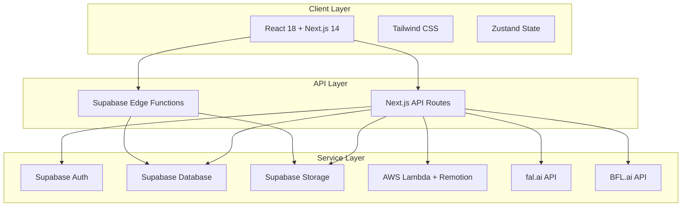
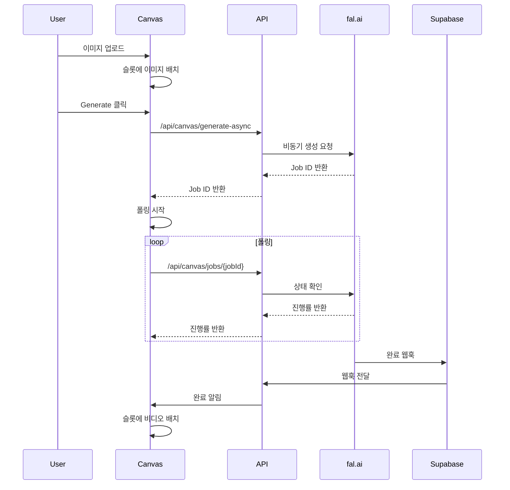

# VogueDrop 아키텍처 가이드

이 문서는 VogueDrop의 전체 아키텍처를 프론트엔드와 백엔드를 통합하여 설명합니다.

## 📋 목차

1. [개요](#개요)
2. [기술 스택](#기술-스택)
3. [프로젝트 구조](#프로젝트-구조)
4. [아키텍처 패턴](#아키텍처-패턴)
5. [Canvas 시스템](#canvas-시스템)
6. [Video Editor 시스템](#video-editor-시스템)
7. [상태 관리](#상태-관리)
8. [API 설계](#api-설계)
9. [성능 최적화](#성능-최적화)

## 개요

VogueDrop은 AI 기반 비디오 생성 및 편집 플랫폼으로, 다음과 같은 핵심 특징을 가집니다:

- **Jamstack 아키텍처**: Next.js 14+ App Router 기반
- **서버리스**: Vercel + Supabase + AWS Lambda
- **타입 안전성**: 전체 스택 TypeScript
- **모듈러 설계**: 기능별 Context 분리
- **실시간 처리**: AI 비디오 생성 및 진행률 추적

### 시스템 아키텍처 다이어그램



## 기술 스택

### 전체 기술 스택 표

| 카테고리 | 기술 | 버전 | 목적 | 선택 이유 |
|----------|------|------|------|-----------|
| **Frontend** |
| 언어 | TypeScript | 5.3+ | 타입 안전성 | 런타임 에러 방지, IDE 지원 |
| 프레임워크 | Next.js | 14.2+ | React 프레임워크 | SSR/SSG, API Routes, 최적화 |
| UI 라이브러리 | React | 18.2+ | 컴포넌트 기반 UI | 업계 표준, 생태계 |
| 스타일링 | Tailwind CSS | 3.4+ | 유틸리티 CSS | 빠른 개발, 일관된 디자인 |
| 상태 관리 | Zustand | 4.5+ | 클라이언트 상태 | 간단한 API, 작은 번들 크기 |
| **Backend** |
| API 스타일 | REST | - | HTTP API | 단순함, 잘 알려진 패턴 |
| 데이터베이스 | PostgreSQL | 15+ | 관계형 DB | Supabase 통합, 강력한 기능 |
| 인증 | Supabase Auth | 2.0+ | 사용자 인증 | 내장 이메일/비밀번호, 세션 관리 |
| 파일 저장소 | Supabase Storage | - | 미디어 파일 | 통합 인증, 직접 브라우저 업로드 |
| **AI Services** |
| 비디오 생성 | fal.ai | - | AI 비디오 생성 | 고품질, 빠른 처리 |
| 이미지 편집 | BFL.ai | - | Image Brush | FLUX 모델, 고품질 |
| I2I 처리 | RunPod | - | Image-to-Image | ComfyUI, 커스터마이징 |
| **Infrastructure** |
| 호스팅 | Vercel | - | 프론트엔드 호스팅 | 자동 배포, Edge Network |
| 서버리스 | AWS Lambda | - | 비디오 렌더링 | Remotion 통합, 확장성 |
| CDN | Vercel Edge | - | 정적 자산 | 자동 캐싱, 글로벌 배포 |

## 프로젝트 구조

### 디렉토리 구조

```
voguedrop/
├── src/
│   ├── app/                          # Next.js App Router
│   │   ├── (auth)/                   # 인증 라우트 그룹
│   │   │   ├── login/page.tsx
│   │   │   └── signup/page.tsx
│   │   ├── (home)/                   # 홈 라우트 그룹
│   │   │   ├── _components/
│   │   │   └── page.tsx
│   │   ├── canvas/                   # Canvas AI 기능
│   │   │   ├── _components/          # 기능별 컴포넌트
│   │   │   ├── _context/            # Canvas 전용 Context
│   │   │   ├── _hooks/              # Canvas 전용 훅
│   │   │   └── page.tsx
│   │   ├── video-editor/            # 비디오 에디터
│   │   │   ├── _components/
│   │   │   ├── _context/            # 에디터 전용 Context
│   │   │   ├── _hooks/
│   │   │   └── page.tsx
│   │   ├── api/                     # API 라우트
│   │   │   ├── auth/                # 인증 API
│   │   │   ├── canvas/              # Canvas API
│   │   │   ├── video/               # 비디오 API
│   │   │   └── webhooks/            # 웹훅
│   │   ├── globals.css
│   │   ├── layout.tsx
│   │   └── page.tsx
│   ├── shared/                      # 공유 리소스
│   │   ├── components/              # 재사용 가능한 UI
│   │   │   ├── ui/                  # 기본 UI 컴포넌트
│   │   │   └── modals/              # 모달 시스템
│   │   ├── hooks/                   # 전역 훅
│   │   ├── lib/                     # 유틸리티 및 설정
│   │   ├── types/                   # 전역 타입 정의
│   │   └── constants/               # 전역 상수
│   ├── features/                    # 기능별 모듈
│   │   ├── canvas-generation/       # Canvas 생성 기능
│   │   ├── video-editing/           # 비디오 편집 기능
│   │   ├── media-library/           # 미디어 라이브러리
│   │   └── user-auth/               # 사용자 인증
│   ├── infrastructure/              # 인프라 관련
│   │   ├── supabase/               # Supabase 클라이언트
│   │   ├── ai-services/            # AI 서비스 통합
│   │   └── cache/                  # 캐싱 로직
│   └── remotion/                   # Remotion 비디오 템플릿
├── supabase/                       # Supabase 설정
│   ├── functions/                  # Edge Functions
│   ├── migrations/                 # DB 마이그레이션
│   └── seeds/                      # 초기 데이터
├── lambda/                         # AWS Lambda 함수
└── docs/                          # 문서
```

### 기능 중심 구조 원칙

1. **Co-location**: 관련 파일들을 가까이 배치
2. **Feature-first**: 기능별로 폴더 구성
3. **Shared vs Specific**: 공유 리소스와 기능별 리소스 분리
4. **Type Safety**: 모든 레벨에서 TypeScript 활용

## 아키텍처 패턴

### 1. Jamstack 아키텍처
- **정적 생성**: 빌드 시 페이지 사전 생성
- **동적 API**: 서버리스 함수로 동적 기능 제공
- **CDN 배포**: 전 세계 엣지 네트워크 활용

### 2. 서버 컴포넌트 패턴 (RSC)
```typescript
// app/canvas/page.tsx - Server Component
export default async function CanvasPage() {
  // 서버에서 데이터 페칭
  const effects = await getEffects();
  
  return (
    <CanvasProviders>
      <CanvasClient effects={effects} />
    </CanvasProviders>
  );
}

// _components/CanvasClient.tsx - Client Component
'use client';
export function CanvasClient({ effects }: { effects: Effect[] }) {
  // 클라이언트 상호작용
  return <Canvas effects={effects} />;
}
```

### 3. Context 기반 상태 관리
```typescript
// 계층적 Context 구조
CanvasProviders
├── SettingsProvider     // AI 생성 설정
├── ModalProvider        // 모달 상태
├── SlotProvider         // 4슬롯 관리
├── EffectsProvider      // 효과 선택
└── GenerationProvider   // 생성 플로우
```

### 4. API Route 패턴
```typescript
// app/api/canvas/generate/route.ts
export async function POST(request: Request) {
  try {
    const { imageUrl, effectIds, prompt } = await request.json();
    
    // 입력 검증
    const validation = validateGenerationRequest({ imageUrl, effectIds, prompt });
    if (!validation.success) {
      return NextResponse.json({ error: validation.error }, { status: 400 });
    }
    
    // 비즈니스 로직
    const result = await generateVideo({ imageUrl, effectIds, prompt });
    
    return NextResponse.json({ success: true, data: result });
  } catch (error) {
    console.error('Generation failed:', error);
    return NextResponse.json(
      { error: 'Internal server error' }, 
      { status: 500 }
    );
  }
}
```

## Canvas 시스템

### Context 아키텍처

Canvas는 7개의 전문화된 Context로 구성됩니다:

#### 1. SettingsContext
```typescript
interface SettingsContextType {
  // AI 생성 설정
  promptText: string;
  negativePrompt: string;
  selectedResolution: '1:1' | '16:9' | '9:16';
  selectedSize: string;
  selectedModelId: string;
  selectedDuration: number;
  
  // 함수
  updateSettings: (settings: Partial<Settings>) => void;
  resetSettings: () => void;
}
```

#### 2. SlotContext
```typescript
interface SlotContextType {
  // 4슬롯 상태
  slotContents: Array<SlotContent | null>;
  slotStates: Array<'empty' | 'generating' | 'completed'>;
  slotCompletedAt: Array<number | null>;
  selectedSlotIndex: number | null;
  
  // 슬롯 관리 함수
  handleImageUpload: (imageUrl: string) => void;
  handleVideoToggle: (video: GeneratedVideo) => void;
  markSlotGenerating: (slotIndex: number, imageUrl: string) => void;
  placeVideoInSlot: (slotIndex: number, video: GeneratedVideo) => void;
}
```

### 슬롯 배치 우선순위 규칙

1. **이미지 업로드**: 빈 슬롯 → 이미지 슬롯(진행 중 제외) → 가장 오래된 완료 비디오
2. **Generate 실행**: 현재 이미지와 일치하는 슬롯 → 빈 슬롯 → 가장 오래된 완료
3. **히스토리 선택**: 빈 슬롯 → 이미지 슬롯 → 가장 오래된 완료 비디오

### 생성 플로우



## Video Editor 시스템

### Context 계층 구조

```
VideoEditorProviders
├── ProjectProvider      // 프로젝트 메타데이터, UI 상태
│   └── ClipProvider     // 클립 관리, 편집 상태
│       └── HistoryProvider  // 실행 취소/다시 실행
│           └── PlaybackProvider  // 재생 제어
```

### 주요 Context 설명

#### 1. ProjectContext
- **역할**: 프로젝트 메타데이터 및 UI 상태 관리
- **상태**: 프로젝트 제목, 자동 저장, 타임라인 높이, 모달 관리

#### 2. ClipContext
- **역할**: 모든 클립(비디오, 텍스트, 사운드)의 생명주기 관리
- **상태**: timelineClips, textClips, soundClips, 편집 상태

#### 3. HistoryContext
- **역할**: 실행 취소/다시 실행 기능
- **상태**: history 스택, currentIndex, 변경 추적

#### 4. PlaybackContext
- **역할**: 비디오 재생 제어
- **상태**: 재생 상태, 현재 시간, 재생 속도

### 타임라인 시스템

```typescript
interface TimelineClip {
  id: string;
  videoId: string;
  startTime: number;      // 타임라인에서의 시작 시간
  duration: number;       // 클립 길이
  trimStart: number;      // 원본에서 자른 시작점
  trimEnd: number;        // 원본에서 자른 끝점
  volume: number;         // 볼륨 (0-1)
  speed: number;          // 재생 속도 (0.5-2.0)
}
```

## 상태 관리

### 1. 로컬 상태 (React Hooks)
```typescript
// 컴포넌트 내부 상태
const [isLoading, setIsLoading] = useState(false);
const [error, setError] = useState<string | null>(null);
```

### 2. Context 상태 (React Context)
```typescript
// 기능별 Context
const { slotContents, handleImageUpload } = useSlot();
const { selectedEffects, toggleEffect } = useEffects();
```

### 3. 전역 상태 (Zustand)
```typescript
// stores/authStore.ts
interface AuthState {
  user: User | null;
  isLoading: boolean;
  signIn: (email: string, password: string) => Promise<void>;
  signOut: () => Promise<void>;
}

export const useAuthStore = create<AuthState>((set, get) => ({
  user: null,
  isLoading: false,
  signIn: async (email, password) => {
    set({ isLoading: true });
    try {
      const { data } = await supabase.auth.signInWithPassword({ email, password });
      set({ user: data.user, isLoading: false });
    } catch (error) {
      set({ isLoading: false });
      throw error;
    }
  },
  signOut: async () => {
    await supabase.auth.signOut();
    set({ user: null });
  },
}));
```

### 4. 서버 상태 (React Query - 향후 도입 예정)
```typescript
// hooks/useGenerationHistory.ts
export function useGenerationHistory() {
  return useQuery({
    queryKey: ['generation-history'],
    queryFn: () => fetchGenerationHistory(),
    staleTime: 5 * 60 * 1000, // 5분
  });
}
```

## API 설계

### RESTful API 구조

```
/api/
├── auth/                    # 인증 관련
│   ├── login/
│   ├── logout/
│   └── refresh/
├── canvas/                  # Canvas 기능
│   ├── generate-async/      # 비동기 생성 시작
│   ├── jobs/[jobId]/       # 생성 작업 상태
│   ├── history/            # 생성 히스토리
│   ├── effects/            # 효과 목록
│   ├── categories/         # 효과 카테고리
│   ├── favorite/           # 즐겨찾기 토글
│   ├── favorites/          # 즐겨찾기 목록
│   ├── library/            # 라이브러리 조회
│   ├── upload/             # 이미지 업로드
│   └── image-brush/        # Image Brush 기능
├── video/                   # 비디오 관련
│   ├── render/             # 비디오 렌더링
│   ├── upload/             # 비디오 업로드
│   └── library/            # 비디오 라이브러리
├── sound/                   # 사운드 관련
│   └── library/            # 사운드 라이브러리
└── webhooks/               # 웹훅
    └── fal-ai/             # fal.ai 완료 웹훅
```

### API 응답 표준

```typescript
// 성공 응답
interface SuccessResponse<T> {
  success: true;
  data: T;
  message?: string;
}

// 에러 응답
interface ErrorResponse {
  success: false;
  error: string;
  code?: string;
  details?: any;
}

// 페이지네이션 응답
interface PaginatedResponse<T> {
  success: true;
  data: T[];
  pagination: {
    page: number;
    limit: number;
    total: number;
    hasMore: boolean;
  };
}
```

### 에러 처리 패턴

```typescript
// API Route 에러 처리
export async function POST(request: Request) {
  try {
    // 입력 검증
    const body = await request.json();
    const validation = validateInput(body);
    if (!validation.success) {
      return NextResponse.json(
        { success: false, error: validation.error },
        { status: 400 }
      );
    }

    // 비즈니스 로직
    const result = await processRequest(validation.data);
    
    return NextResponse.json({
      success: true,
      data: result
    });
  } catch (error) {
    console.error('API Error:', error);
    
    if (error instanceof ValidationError) {
      return NextResponse.json(
        { success: false, error: error.message },
        { status: 400 }
      );
    }
    
    if (error instanceof AuthError) {
      return NextResponse.json(
        { success: false, error: 'Unauthorized' },
        { status: 401 }
      );
    }
    
    return NextResponse.json(
      { success: false, error: 'Internal server error' },
      { status: 500 }
    );
  }
}
```

## 성능 최적화

### 1. 번들 최적화
```typescript
// next.config.ts
const nextConfig = {
  // 동적 임포트로 코드 분할
  experimental: {
    optimizePackageImports: ['@supabase/supabase-js', 'zustand']
  },
  
  // 이미지 최적화
  images: {
    domains: ['supabase.co'],
    formats: ['image/webp', 'image/avif']
  }
};
```

### 2. 컴포넌트 최적화
```typescript
// React.memo로 불필요한 리렌더링 방지
export const Canvas = React.memo(function Canvas({ slotContents }: CanvasProps) {
  return (
    <div className="grid grid-cols-2 gap-4">
      {slotContents.map((content, index) => (
        <SlotItem key={index} content={content} index={index} />
      ))}
    </div>
  );
});

// useMemo로 비싼 계산 캐싱
const sortedVideos = useMemo(() => {
  return videos.sort((a, b) => new Date(b.createdAt).getTime() - new Date(a.createdAt).getTime());
}, [videos]);

// useCallback으로 함수 참조 안정화
const handleImageUpload = useCallback((imageUrl: string) => {
  setSlotContents(prev => {
    const targetSlot = findEmptySlot(prev) || findOldestSlot(prev);
    const newSlots = [...prev];
    newSlots[targetSlot] = { type: 'image', data: imageUrl };
    return newSlots;
  });
}, []);
```

### 3. 데이터 페칭 최적화
```typescript
// Server Components에서 병렬 데이터 페칭
export default async function CanvasPage() {
  const [effects, categories, userHistory] = await Promise.all([
    getEffects(),
    getCategories(),
    getUserHistory()
  ]);
  
  return (
    <CanvasClient 
      effects={effects}
      categories={categories}
      initialHistory={userHistory}
    />
  );
}

// 클라이언트에서 점진적 로딩
function HistoryPanel() {
  const [page, setPage] = useState(1);
  const { data, isLoading } = useInfiniteQuery({
    queryKey: ['history', page],
    queryFn: ({ pageParam = 1 }) => fetchHistory(pageParam),
    getNextPageParam: (lastPage) => lastPage.hasMore ? lastPage.page + 1 : undefined
  });
  
  return (
    <InfiniteScroll
      hasMore={data?.pages[data.pages.length - 1]?.hasMore}
      loadMore={() => setPage(prev => prev + 1)}
    >
      {data?.pages.map(page => 
        page.data.map(video => <VideoItem key={video.id} video={video} />)
      )}
    </InfiniteScroll>
  );
}
```

### 4. 캐싱 전략
```typescript
// API Route 캐싱
export async function GET() {
  const effects = await getEffects();
  
  return NextResponse.json(effects, {
    headers: {
      'Cache-Control': 'public, s-maxage=3600, stale-while-revalidate=86400'
    }
  });
}

// 클라이언트 캐싱
const effectsCache = new Map<string, Effect[]>();

export async function fetchEffects(category?: string): Promise<Effect[]> {
  const cacheKey = category || 'all';
  
  if (effectsCache.has(cacheKey)) {
    return effectsCache.get(cacheKey)!;
  }
  
  const effects = await fetch(`/api/canvas/effects?category=${category}`).then(r => r.json());
  effectsCache.set(cacheKey, effects);
  
  return effects;
}
```

---

이 아키텍처 가이드는 VogueDrop의 전체 시스템을 이해하고 개발하는 데 필요한 모든 정보를 제공합니다. 각 섹션은 실제 구현과 일치하며, 새로운 기능 개발이나 기존 기능 수정 시 참고할 수 있습니다.
