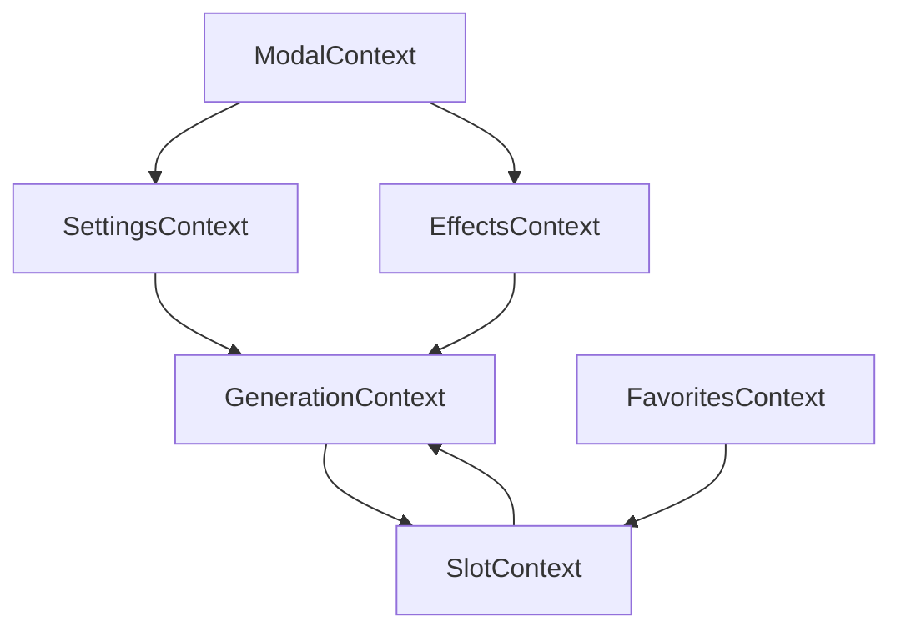

# Canvas 시스템 아키텍처 문서

VogueDrop Canvas는 AI 기반 영상 생성을 위한 핵심 페이지로, 사용자가 이미지를 업로드하고 효과를 선택하여 AI 영상을 생성할 수 있습니다.

## 📋 목차

1. [개요](#개요)
2. [Context 기반 아키텍처](#context-기반-아키텍처)
3. [Context별 상세 문서](#context별-상세-문서)
4. [데이터 흐름](#데이터-흐름)
5. [사용법 가이드](#사용법-가이드)
6. [성능 최적화](#성능-최적화)
7. [트러블슈팅](#트러블슈팅)

## 개요

Canvas 시스템은 다음과 같은 핵심 기능을 제공합니다:

- **4슬롯 시스템**: 이미지/비디오를 4개 슬롯에 배치하여 관리
- **AI 영상 생성**: fal.ai API를 통한 비동기 영상 생성
- **효과 시스템**: 최대 2개 효과 선택 및 적용
- **히스토리 관리**: 생성된 영상의 히스토리 및 즐겨찾기
- **실시간 미리보기**: 생성 진행상황 실시간 추적
- **모달 시스템**: 다양한 기능별 모달 인터페이스

## Context 기반 아키텍처

Canvas 페이지는 기능별로 분리된 7개의 Context로 구성되어 있습니다:

```
CanvasProviders (루트)
├── SettingsProvider     - AI 생성 설정 관리
├── ModalProvider        - 모달 상태 관리  
├── SlotProvider         - 4슬롯 콘텐츠 관리
├── FavoritesProvider    - 즐겨찾기 관리
├── EffectsProvider      - 효과 선택 관리
└── GenerationProvider  - 영상 생성 플로우 관리
```

### 아키텍처 장점

- **관심사 분리**: 각 Context가 명확한 단일 책임을 가짐
- **성능 최적화**: 필요한 상태만 구독하여 불필요한 리렌더링 방지
- **유지보수성**: 기능별로 독립적인 상태 관리
- **테스트 용이성**: 각 Context를 독립적으로 테스트 가능
- **확장성**: 새로운 기능 추가 시 기존 Context에 영향 없음

## Context별 상세 문서

### 1. SettingsContext

**역할**: AI 영상 생성에 필요한 모든 설정 관리

**관리하는 상태**:
- `promptText`: 사용자 입력 프롬프트
- `negativePrompt`: 네거티브 프롬프트
- `selectedResolution`: 영상 비율 (1:1, 16:9, 9:16)
- `selectedSize`: 픽셀 크기 (1024x1024, 1920x1080 등)
- `selectedModelId`: 사용할 AI 모델 ID
- `selectedDuration`: 영상 길이 (초)
- `isPrompterOpen`: 프롬프트 모달 상태

**제공하는 함수**:
- `updateSettings(settings)`: 설정 업데이트
- `resetSettings()`: 설정 초기화

### 2. SlotContext

**역할**: 4개 슬롯의 콘텐츠와 상태 관리

**관리하는 상태**:
- `slotContents`: 각 슬롯의 이미지/비디오 데이터
- `slotStates`: 슬롯 상태 (empty, generating, completed)
- `slotCompletedAt`: 생성 완료 시간
- `selectedSlotIndex`: 현재 선택된 슬롯
- `activeVideo`: 현재 재생 중인 비디오

**제공하는 함수**:
- `handleImageUpload()`: 이미지 업로드 및 슬롯 배치
- `handleVideoToggle()`: 히스토리 비디오 슬롯 토글
- `markSlotGenerating()`: 슬롯을 생성 중 상태로 변경
- `placeVideoInSlot()`: 생성된 비디오를 슬롯에 배치
- `resetSlot()`: 슬롯 초기화

### 3. ModalContext

**역할**: 모든 모달의 열기/닫기 상태 관리

**관리하는 모달**:
- `library`: 히스토리 라이브러리
- `effect`: 효과 선택
- `prompt`: 프롬프트 입력
- `camera`: 카메라 캡처
- `model`: AI 모델 선택
- `projectTitle`: 프로젝트 제목
- `imageBrush`: 이미지 브러시 편집

**제공하는 함수**:
- `openModal(name)`: 특정 모달 열기
- `closeModal(name)`: 특정 모달 닫기
- `toggleModal(name)`: 모달 토글
- `closeAllModals()`: 모든 모달 닫기

### 4. EffectsContext

**역할**: 효과 선택 및 관리 (최대 2개)

**관리하는 상태**:
- `selectedEffects`: 선택된 효과 배열
- `canAddMore`: 추가 선택 가능 여부
- `maxEffects`: 최대 선택 가능 효과 수

**제공하는 함수**:
- `addEffect(effect)`: 효과 추가
- `removeEffect(effectId)`: 효과 제거
- `toggleEffect(effect)`: 효과 토글
- `clearEffects()`: 모든 효과 제거

### 5. FavoritesContext

**역할**: 즐겨찾기 관리

**관리하는 상태**:
- `favoriteIds`: 즐겨찾기 비디오 ID 셋
- `isLoading`: 로딩 상태
- `error`: 에러 메시지

**제공하는 함수**:
- `toggleFavorite(videoId)`: 즐겨찾기 토글
- `isFavorite(videoId)`: 즐겨찾기 여부 확인
- `refreshFavorites()`: 즐겨찾기 목록 새로고침

### 6. GenerationContext

**역할**: AI 영상 생성 플로우 관리

**관리하는 상태**:
- `isGenerating`: 생성 중 여부
- `canGenerate`: 생성 가능 여부
- `generatingProgress`: 각 job의 진행률
- `generatingJobIds`: 활성 job ID 맵
- `generationError`: 생성 에러 메시지

**제공하는 함수**:
- `generateVideo()`: 영상 생성 시작
- `isSlotGenerating(index)`: 특정 슬롯 생성 중 여부
- `setGenerationError(error)`: 에러 상태 설정

## 데이터 흐름

### 영상 생성 플로우

1. **사용자 입력**
   - 이미지 업로드 → SlotContext → 빈 슬롯에 배치
   - 효과 선택 → EffectsContext → 최대 2개 선택
   - 설정 입력 → SettingsContext → 프롬프트, 해상도 등

2. **생성 시작**
   - GenerationContext → `generateVideo()` 호출
   - SlotContext → 해당 슬롯을 `generating` 상태로 변경
   - API 요청 → Job ID 받아 추적 시작

3. **진행 추적**
   - 3초마다 polling → 진행률 업데이트
   - 실시간 UI 업데이트 → 프로그레스 바 표시

4. **생성 완료**
   - 영상 수신 → SlotContext → 슬롯에 비디오 배치
   - 상태 변경 → `completed`로 업데이트
   - 히스토리 업데이트 → 생성된 영상 목록에 추가

### 상태 간 의존성



## 사용법 가이드

### 1. 기본 사용법

```tsx
// App.tsx
import { CanvasProviders } from '@/app/canvas/_context/CanvasProviders';

function App() {
  return (
    <CanvasProviders>
      <CanvasPage />
    </CanvasProviders>
  );
}
```

### 2. 개별 Context 사용

```tsx
// 설정 변경
import { useSettings } from '@/app/canvas/_context/SettingsContext';

function PromptInput() {
  const { settings } = useSettings();
  
  const handleChange = (text: string) => {
    settings.updateSettings({ promptText: text });
  };

  return (
    <input 
      value={settings.promptText} 
      onChange={e => handleChange(e.target.value)}
    />
  );
}
```

```tsx
// 슬롯 관리
import { useSlot } from '@/app/canvas/_context/SlotContext';

function CanvasGrid() {
  const { slotManager } = useSlot();
  
  const handleImageUpload = (imageUrl: string) => {
    slotManager.handleImageUpload(imageUrl, slotManager.isSlotGenerating);
  };

  return (
    <div className="grid grid-cols-2 gap-4">
      {slotManager.slotContents.map((content, index) => (
        <CanvasSlot 
          key={index} 
          index={index}
          content={content}
          state={slotManager.slotStates[index]}
          onSelect={() => slotManager.setSelectedSlotIndex(index)}
        />
      ))}
    </div>
  );
}
```

### 3. 통합 Context 사용

```tsx
// 모든 Context에 접근
import { useCanvas } from '@/app/canvas/_context/CanvasProviders';

function CanvasControls() {
  const {
    settings,
    slotManager,
    modals,
    effects,
    favorites,
    videoGeneration
  } = useCanvas();

  const handleGenerate = async () => {
    if (videoGeneration.canGenerate) {
      await videoGeneration.generateVideo();
    }
  };

  return (
    <div>
      <button 
        onClick={handleGenerate}
        disabled={!videoGeneration.canGenerate}
      >
        {videoGeneration.isGenerating ? '생성 중...' : '영상 생성'}
      </button>
    </div>
  );
}
```

## 성능 최적화

### 1. 선택적 구독

각 컴포넌트는 필요한 Context만 구독하여 불필요한 리렌더링을 방지합니다:

```tsx
// ❌ 모든 상태 구독 (불필요한 리렌더링)
const canvas = useCanvas();

// ✅ 필요한 상태만 구독
const { settings } = useSettings();
const { modals } = useModals();
```

### 2. 메모이제이션

Context 값들은 `useCallback`과 `useMemo`로 최적화되어 있습니다:

```tsx
// Context 내부에서 자동으로 메모이제이션
const updateSettings = useCallback((newSettings: Partial<CanvasSettings>) => {
  setSettingsState(prev => ({ ...prev, ...newSettings }));
}, []);
```

### 3. 조건부 렌더링

상태에 따른 조건부 렌더링으로 불필요한 계산을 방지합니다:

```tsx
function VideoPreview() {
  const { slotManager } = useSlot();
  
  // 비디오가 있을 때만 렌더링
  if (!slotManager.activeVideo) return null;
  
  return <VideoPlayer video={slotManager.activeVideo} />;
}
```

## 트러블슈팅

### 1. Context Provider 에러

**에러**: `useSettings must be used within SettingsProvider`

**해결**: 컴포넌트가 해당 Provider 내부에 있는지 확인

```tsx
// ❌ Provider 외부에서 사용
function MyComponent() {
  const { settings } = useSettings(); // 에러 발생
}

// ✅ Provider 내부에서 사용
<SettingsProvider>
  <MyComponent />
</SettingsProvider>
```

### 2. 상태 업데이트 안됨

**원인**: 잘못된 Context 사용 또는 Provider 누락

**해결**: Context 트리 구조 확인

```tsx
// 올바른 Provider 순서
<CanvasProviders>  // 모든 Provider 포함
  <CanvasPage />
</CanvasProviders>
```

### 3. 성능 이슈

**원인**: 과도한 리렌더링

**해결**: React DevTools Profiler로 렌더링 패턴 분석

```tsx
// Context 분리하여 관심사별로 구독
const { settings } = useSettings();        // 설정만 필요한 컴포넌트
const { slotManager } = useSlot();         // 슬롯만 필요한 컴포넌트
```

### 4. 메모리 누수

**원인**: Context에서 관리하는 타이머나 이벤트 리스너

**해결**: useEffect cleanup 함수 구현

```tsx
useEffect(() => {
  const interval = setInterval(pollProgress, 3000);
  return () => clearInterval(interval); // cleanup
}, []);
```

## 마이그레이션 가이드

### 이전 useCanvas 훅에서 새 Context로 마이그레이션

**이전 방식**:
```tsx
import { useCanvas } from './useCanvas';

function Component() {
  const { images, toggleFavorite } = useCanvas();
}
```

**새 방식**:
```tsx
import { useSlot } from '@/app/canvas/_context/SlotContext';
import { useFavorites } from '@/app/canvas/_context/FavoritesContext';

function Component() {
  const { slotManager } = useSlot();
  const { favorites } = useFavorites();
}
```

## 참고 자료

- [React Context 공식 문서](https://react.dev/reference/react/createContext)
- [VogueDrop 프론트엔드 아키텍처](./frontend-architecture.md)
- [Canvas 구현 가이드](../.cursor/rules/canvas-implementation-guide.mdc)
- [슬롯 매니저 마이그레이션 태스크](./task/task_slot_manager_context_migration.md)