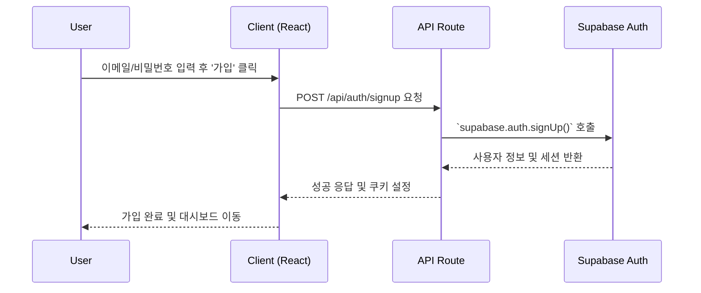

# Authentication API & Code Guide

## 1. 개요
이 문서는 VogueDrop의 사용자 인증(회원가입, 로그인, 로그아웃, 세션 관리) 기능에 대한 기술적인 가이드를 제공합니다. Supabase Auth를 사용하여 구현되었습니다.

## 2. 핵심 워크플로우

## 3. 주요 파일 및 코드 위치

### 프론트엔드 컴포넌트
- **로그인/회원가입 UI**:
  - `src/app/(auth)/login/page.tsx`
  - `src/app/(auth)/signup/page.tsx`
- **헤더 (로그인/로그아웃 버튼)**: `src/components/layout/Header.tsx`

### 핵심 로직
- **Supabase 클라이언트 생성**:
  - `src/lib/supabase/client.ts` (클라이언트 컴포넌트용)
  - `src/lib/supabase/server.ts` (서버 컴포넌트/API 라우트용)
- **인증 커스텀 훅**: `src/hooks/use-user.ts` (React Query 기반 사용자 정보 조회)

### 백엔드 (미들웨어)
- **세션 관리 및 라우트 보호**: `middleware.ts` (루트 디렉토리)

### 데이터베이스
- **사용자 테이블**: `auth.users` (Supabase에서 자동 관리)
- **RLS 정책**: `docs/RLS_POLICIES.md` 참조

## 4. 주요 API 엔드포인트
VogueDrop은 Next.js API Route를 직접 사용하기보다, Supabase의 Auth Helpers (`@supabase/ssr`)를 통해 클라이언트 및 서버 컴포넌트에서 직접 인증을 처리합니다.

- **인증 콜백**: `src/app/auth/callback/route.ts`
  - 소셜 로그인 또는 이메일 인증 후 리디렉션되는 경로입니다.
  - 세션 코드를 실제 세션으로 교환하는 역할을 합니다.

## 5. 시나리오 예시: "비밀번호 재설정 기능 추가"
AI 에이전트가 이 작업을 수행해야 할 경우, 다음 단계를 따릅니다.

1.  **기능 분석**: "비밀번호 재설정"은 Supabase Auth의 기본 기능입니다. `supabase.auth.resetPasswordForEmail()` 함수를 사용해야 함을 파악합니다.
2.  **UI 위치 파악**: 로그인 페이지에 "비밀번호를 잊으셨나요?" 링크를 추가해야 합니다.
    - **참고 파일**: `src/app/(auth)/login/page.tsx`
3.  **UI 구현**: 이메일 입력을 위한 새로운 페이지 또는 모달을 생성합니다.
    - **참고 파일**: `src/app/(auth)/forgot-password/page.tsx` (신규 생성)
4.  **API 연동**: 사용자가 이메일을 입력하고 제출하면, Supabase 클라이언트를 사용하여 비밀번호 재설정 이메일을 전송하는 함수를 호출합니다.
    - **참고 파일**: `src/lib/supabase/client.ts`의 `createClient()`를 사용하여 `page.tsx` 내에서 직접 Supabase 함수를 호출합니다.
5.  **재설정 페이지 구현**: 사용자가 이메일에서 링크를 클릭했을 때 도달할 새 비밀번호 설정 페이지를 만듭니다.
    - **참고 파일**: `src/app/(auth)/reset-password/page.tsx` (신규 생성)
    - 이 페이지는 `supabase.auth.updateUser()` 함수를 사용하여 비밀번호를 업데이트합니다.
