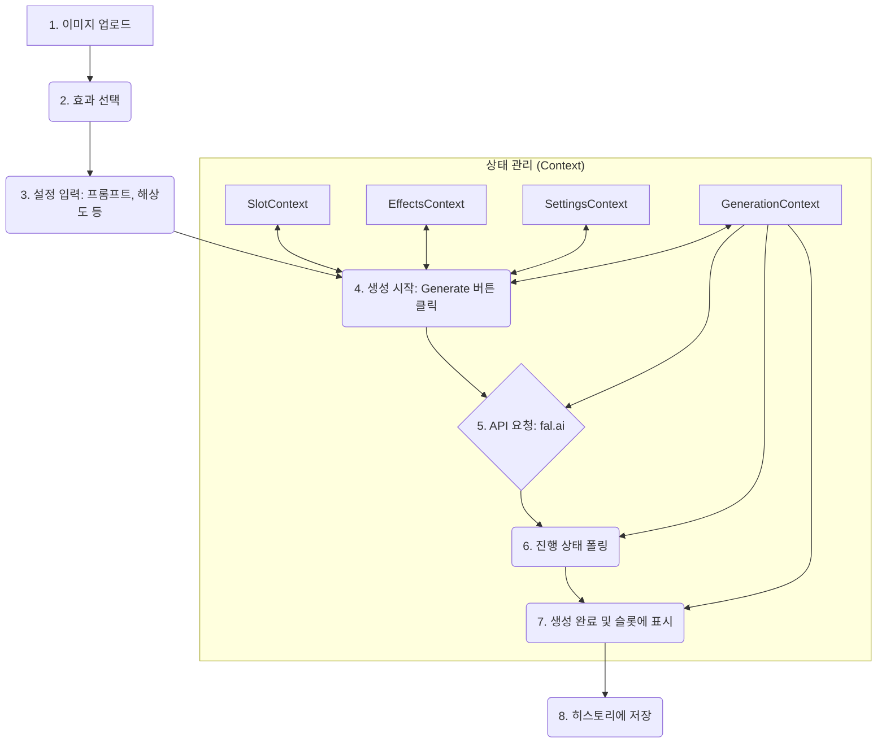

# Canvas (AI 영상 생성) API & Code Guide

## 1. 개요
Canvas는 VogueDrop의 핵심 기능으로, 사용자가 이미지를 업로드하고 여러 AI 효과를 조합하여 동영상을 생성하는 페이지입니다. 상태 관리는 다수의 React Context로 분리되어 관리됩니다.

## 2. 핵심 워크플로우


## 3. 주요 파일 및 코드 위치

### 프론트엔드 컴포넌트
- **메인 페이지**: `src/app/canvas/page.tsx`
- **레이아웃 및 UI**: `src/app/canvas/_components/`
  - `CanvasLayout.tsx`: 전체 UI 구조
  - `Canvas.tsx`: 4개의 슬롯을 포함하는 캔버스 영역
  - `Prompter.tsx`: 효과, 모델 등을 선택하는 좌측 패널
  - `CanvasControls.tsx`: 생성 버튼 등 하단 컨트롤 바

### 상태 관리 (React Context)
- **통합 Provider**: `src/app/canvas/_context/CanvasProviders.tsx`
- **개별 Context**: `src/app/canvas/_context/` 폴더 내
  - `SettingsContext.tsx`: 프롬프트, 해상도 등 AI 생성 설정
  - `SlotContext.tsx`: 4개 슬롯의 콘텐츠(이미지/비디오) 및 상태
  - `EffectsContext.tsx`: 선택된 AI 효과 목록
  - `GenerationContext.tsx`: 영상 생성 API 호출 및 진행 상태 추적
  - `ModalContext.tsx`: 모든 모달 상태
  - `FavoritesContext.tsx`: 즐겨찾기 상태

### 핵심 로직
- **AI API 연동**: `src/lib/fal-ai.ts` (fal.ai API 호출)
- **API 웹훅 처리**: `src/lib/fal-webhook.ts`
- **슬롯 관리 로직**: `src/app/canvas/_hooks/useSlotManager.ts`

### 백엔드 (API Routes)
- **영상 생성 요청**: `src/app/api/fal/proxy/route.ts` (fal.ai API 프록시)
- **웹훅 수신**: `src/app/api/fal/webhook/route.ts`

### 데이터베이스
- **관련 테이블**: `video_generations`, `effect_templates`, `media_assets`
- **RLS 정책**: `docs/RLS_POLICIES.md` 참조

## 4. 주요 API 엔드포인트

- **`POST /api/fal/proxy`**:
  - **역할**: 클라이언트의 영상 생성 요청을 받아 fal.ai 큐에 작업을 등록합니다.
  - **요청**: `prompt`, `image_url`, `model`, `fal_webhook` 등
  - **응답**: fal.ai의 `request_id`를 포함한 작업 정보
- **`POST /api/fal/webhook`**:
  - **역할**: fal.ai에서 영상 생성이 완료/실패했을 때 호출되는 웹훅입니다.
  - **요청**: 생성 결과(비디오 URL 등) 또는 에러 정보
  - **처리**: `video_generations` 테이블의 상태를 업데이트하고, 클라이언트에 실시간으로 알림을 보냅니다.

## 5. 시나리오 예시: "영상 생성 시 선택 가능한 최대 효과 개수 변경"
AI 에이전트가 "최대 2개인 효과 선택을 3개까지 가능하게 바꿔줘"라는 요청을 받았을 때, 다음 단계를 따릅니다.

1.  **기능 분석**: "효과 선택"과 관련된 상태를 관리하는 곳을 찾아야 합니다.
2.  **문서 탐색**: 이 `api-guide.md` 문서를 보고 "상태 관리" 섹션에서 `EffectsContext.tsx`가 효과 선택을 담당한다는 것을 파악합니다.
3.  **코드 위치 특정**: `src/app/canvas/_context/EffectsContext.tsx` 파일을 엽니다.
4.  **코드 수정**: 파일 내에서 `maxEffects`라는 상수를 찾거나, 효과를 추가하는 `addEffect` 함수 로직에서 개수를 제한하는 부분을 찾습니다.
    ```typescript
    // src/app/canvas/_context/EffectsContext.tsx

    // 기존 코드
    const maxEffects = 2; // 이 부분을 찾습니다.

    const addEffect = (effect: Effect) => {
      if (selectedEffects.length >= maxEffects) { // 이 로직을 확인합니다.
        // ...
        return;
      }
      // ...
    };

    // 수정 코드
    const maxEffects = 3; // 값을 3으로 변경합니다.
    ```
5.  **검증**: 변경 후, UI에서 효과를 3개까지 선택할 수 있는지 확인합니다.
