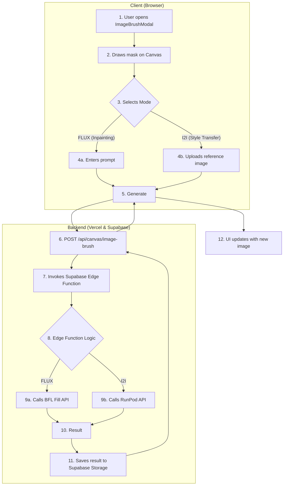

# Image Brush API & Code Guide

## 1. 개요
Image Brush는 사용자가 이미지의 특정 영역을 마스킹하고, AI를 통해 해당 영역을 수정(인페인팅)하거나 다른 이미지의 스타일을 적용(I2I)하는 기능입니다. 이 기능은 복잡한 AI API 연동을 위해 Supabase Edge Function을 사용합니다.

## 2. 핵심 워크플로우


## 3. 주요 파일 및 코드 위치

### 프론트엔드 컴포넌트
- **모달 UI 및 Canvas 로직**: `src/app/canvas/_components/ImageBrushModal.tsx`
- **모달 열기 버튼**: `src/app/canvas/_components/CanvasControls.tsx`

### 백엔드 (API Route & Edge Function)
- **클라이언트 요청 진입점**: `src/app/api/canvas/image-brush/route.ts`
  - 이 API Route는 인증을 확인하고 요청을 Edge Function으로 전달하는 프록시 역할을 합니다.
- **핵심 처리 로직 (Edge Function)**: `supabase/functions/image-brush/index.ts`
  - BFL, RunPod 등 외부 AI 서비스와의 모든 통신을 담당합니다.
- **공유 CORS 설정**: `supabase/functions/_shared/cors.ts`

### 핵심 로직 및 설정
- **RunPod 워크플로우**: `supabase/functions/image-brush/workflow.json`
  - I2I 모드에서 사용되는 ComfyUI 워크플로우 정의 파일입니다.
- **관련 문서**:
  - `docs/features/image-brush-deployment.md` (배포 가이드)
  - `docs/features/runpod-i2i-integration.md` (RunPod 연동 상세)
  - `docs/features/image_brush.md` (BFL/RunPod API 사용법)

### 데이터베이스
- **히스토리 테이블**: `image_brush_history`
  - `supabase/migrations/20240119_create_image_brush_history.sql`
  - `supabase/migrations/20240120_add_i2i_fields.sql`

## 4. 주요 API 엔드포인트

- **`POST /api/canvas/image-brush`**:
  - **역할**: Image Brush 모달에서 "Generate" 버튼 클릭 시 호출됩니다.
  - **요청 본문 (`ImageBrushRequest`)**:
    ```typescript
    {
      image: string; // Base64 원본 이미지
      mask: string;  // Base64 마스크 이미지
      prompt: string; // FLUX 모드용 프롬프트
      mode: 'flux' | 'i2i';
      referenceImage?: string; // I2I 모드용 Base64 참조 이미지
      styleStrength?: number; // I2I 모드용 스타일 강도
    }
    ```
  - **처리**: 이 API는 요청을 그대로 Supabase Edge Function으로 전달합니다.
- **Supabase Edge Function `image-brush`**:
  - **역할**: 실제 AI 작업을 수행합니다. `mode` 값에 따라 분기합니다.
    - `flux`: BFL API를 호출하여 인페인팅을 수행합니다.
    - `i2i`: RunPod API를 호출하여 스타일 전송을 수행합니다.
  - **응답**: 처리된 이미지 URL 또는 에러 메시지를 반환합니다.

## 5. 시나리오 예시: "I2I 모드의 기본 스타일 강도(Style Strength) 변경"
AI 에이전트가 이 작업을 수행해야 할 경우, 다음 단계를 따릅니다.

1.  **기능 분석**: "스타일 강도"는 I2I 모드에만 해당되는 UI 설정값입니다. 이 값의 기본 상태를 관리하는 곳을 찾아야 합니다.
2.  **문서 탐색**: 이 가이드의 "주요 파일 및 코드 위치" 섹션을 보고, 프론트엔드 로직이 `ImageBrushModal.tsx`에 있음을 확인합니다.
3.  **코드 위치 특정**: `src/app/canvas/_components/ImageBrushModal.tsx` 파일을 엽니다.
4.  **코드 수정**: 모달의 상태를 관리하는 `useState` 또는 `useReducer`를 찾습니다. `styleStrength`의 초기값을 설정하는 부분을 수정합니다.
    ```typescript
    // src/app/canvas/_components/ImageBrushModal.tsx

    // state 인터페이스 정의에서 기본값을 찾거나,
    interface ImageBrushState {
      // ...
      styleStrength: number;
    }

    // useState 초기값에서 수정합니다.
    const [state, setState] = useState({
      // ...
      styleStrength: 1.0, // 이 값을 원하는 기본값(예: 0.8)으로 변경
    });
    ```
5.  **백엔드 확인 (선택적)**: 만약 스타일 강도가 백엔드 로직에 영향을 준다면, Edge Function 코드도 확인해야 합니다.
    - **참고 파일**: `supabase/functions/image-brush/index.ts`
    - `callRunPodAPI` 함수로 `styleStrength` 값이 전달되는지, 그리고 ComfyUI 워크플로우의 관련 노드(예: `StyleModelApply`)에 이 값이 제대로 적용되는지 확인합니다. 현재 구현에서는 이 값이 워크플로우에 직접 연결되지는 않았으므로 프론트엔드 수정만으로 충분할 가능성이 높습니다.
