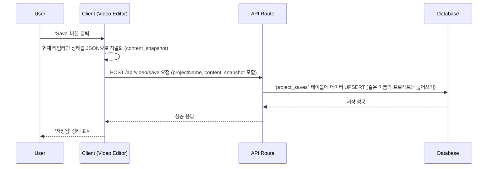
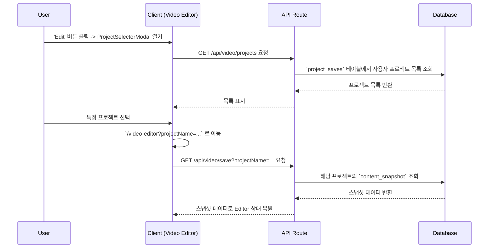

# Project Management API & Code Guide

## 1. 개요
프로젝트 관리 기능은 사용자가 Video Editor에서 작업한 내용을 저장하고, 나중에 다시 불러와서 편집을 계속할 수 있도록 지원합니다. 프로젝트의 모든 상태(클립, 텍스트, 사운드 등)는 데이터베이스에 스냅샷 형태로 저장됩니다.

## 2. 핵심 워크플로우

### 프로젝트 저장


### 프로젝트 불러오기


## 3. 주요 파일 및 코드 위치

### 프론트엔드 컴포넌트
- **프로젝트 선택 모달**: `src/components/modals/ProjectSelectorModal.tsx`
- **비디오 에디터 메인**: `src/app/video-editor/page.tsx`

### 상태 관리 (React Context)
- **프로젝트 정보 및 UI 상태**: `src/app/video-editor/_context/ProjectContext.tsx`
  - 프로젝트 이름, 저장 상태, 로딩 상태 등을 관리합니다.
- **클립 데이터 관리**: `src/app/video-editor/_context/ClipContext.tsx`
  - 비디오, 텍스트, 사운드 클립의 배열과 편집 로직을 관리합니다.
  - 프로젝트 로드 시 `restoreProjectData` 함수를 통해 상태를 복원합니다.

### 백엔드 (API Routes)
- **프로젝트 저장/로드**: `src/app/api/video/save/route.ts`
- **프로젝트 목록 조회**: `src/app/api/video/projects/route.ts`

### 핵심 로직
- **프로젝트 로딩 로직**: `docs/task/task_project_loader.md` 참조
- **API 호출 함수**: `src/lib/api/projects.ts`

### 데이터베이스
- **테이블**: `project_saves`
- **스키마**: `content_snapshot` (JSONB 타입) 컬럼이 핵심입니다.

## 4. 주요 API 엔드포인트

- **`POST /api/video/save`**:
  - **역할**: 현재 Video Editor의 상태를 프로젝트로 저장합니다. (UPSERT)
  - **요청 본문**:
    ```json
    {
      "projectName": "My First Project",
      "contentSnapshot": { /* Video Editor의 전체 상태 */ }
    }
    ```
- **`GET /api/video/save?projectName={name}`**:
  - **역할**: 특정 이름의 프로젝트 데이터를 불러옵니다.
  - **응답**: `{ project: ProjectSave }`
- **`GET /api/video/projects`**:
  - **역할**: 현재 로그인한 사용자의 모든 프로젝트 목록을 조회합니다.
  - **응답**: `{ projects: Project[] }` (썸네일, 이름, 수정 날짜 등 요약 정보)

## 5. 시나리오 예시: "프로젝트 자동 저장 기능 추가"
AI 에이전트가 이 작업을 수행해야 할 경우, 다음 단계를 따릅니다.

1.  **기능 분석**: 자동 저장은 사용자가 편집 활동을 멈춘 후 일정 시간이 지나면 현재 상태를 자동으로 저장하는 기능입니다.
2.  **문서 탐색**: 이 가이드를 통해 프로젝트 저장은 `POST /api/video/save` API를 사용하고, 클라이언트의 상태 관리는 `ProjectContext`와 `ClipContext`에서 이루어짐을 파악합니다.
3.  **코드 위치 특정**:
    - 자동 저장 로직을 트리거할 위치는 사용자의 편집 활동이 발생하는 `ClipContext.tsx`가 적합합니다.
    - 자동 저장 상태(저장 중, 저장됨, 에러) 표시는 `ProjectContext.tsx`에서 관리하는 것이 좋습니다.
4.  **코드 구현**:
    - **`ClipContext.tsx`**:
      - `useEffect`와 `setTimeout` (또는 `use-debounce` 훅)을 사용하여 클립 데이터(`timelineClips`, `textClips` 등)가 변경될 때마다 타이머를 설정합니다.
      - 타이머가 만료되면 `POST /api/video/save` API를 호출하여 자동 저장을 실행합니다.
      - 자동 저장이 시작되거나 완료되면 `ProjectContext`에 상태를 알립니다 (예: CustomEvent 사용).
    - **`ProjectContext.tsx`**:
      - `autoSaveStatus` ('saving', 'saved', 'error') 상태를 추가합니다.
      - `ClipContext`에서 보낸 이벤트를 수신하여 `autoSaveStatus`를 업데이트합니다.
    - **UI 컴포넌트**:
      - `src/app/video-editor/_components/Header.tsx` 등에서 `useProject()` 훅을 통해 `autoSaveStatus`를 구독하고, "저장 중...", "모든 변경사항이 저장되었습니다." 같은 텍스트를 표시합니다.
