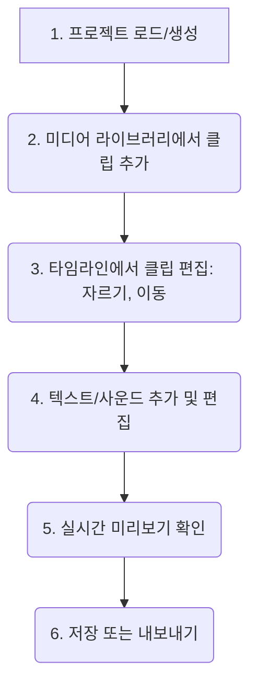
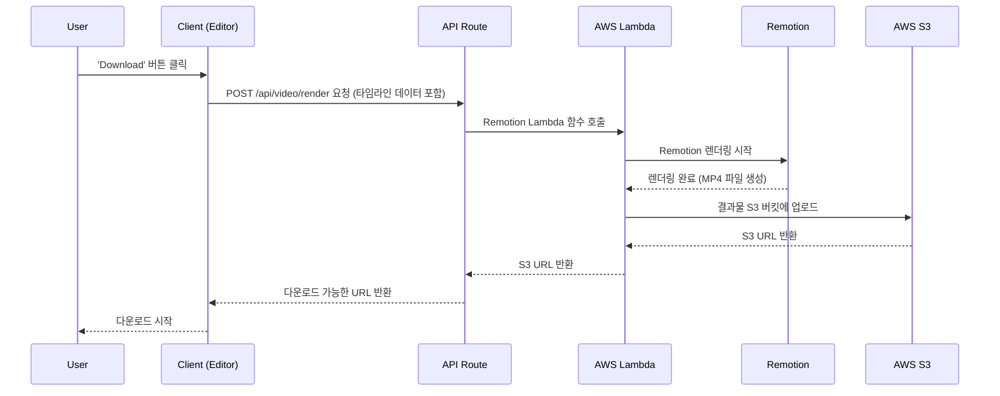

# Video Editor API & Code Guide

## 1. 개요
Video Editor는 사용자가 비디오, 텍스트, 사운드 클립을 조합하여 동영상을 편집하는 기능입니다. 타임라인 기반 인터페이스를 제공하며, Remotion을 사용하여 최종 비디오를 렌더링합니다. 상태 관리는 여러 전문화된 React Context로 분리되어 있습니다.

## 2. 핵심 워크플로우

### 비디오 편집


### 비디오 렌더링 (내보내기)


## 3. 주요 파일 및 코드 위치

### 프론트엔드 컴포넌트
- **메인 페이지**: `src/app/video-editor/page.tsx`
- **주요 UI 컴포넌트**: `src/app/video-editor/_components/`
  - `VideoPreview.tsx`: Remotion Player를 사용한 미리보기 영역
  - `Timeline.tsx`: 클립을 시각적으로 표시하고 조작하는 타임라인
  - `ControlBar.tsx`: 재생, 추가, 내보내기 등 컨트롤 버튼
  - `Header.tsx`: 프로젝트 제목, 저장 상태, 사용자 정보
- **모달**: `src/components/modals/`
  - `VideoLibraryModal.tsx`, `SoundLibraryModal.tsx`

### 상태 관리 (React Context)
- **통합 Provider**: `src/app/video-editor/_context/Providers.tsx`
- **개별 Context**: `src/app/video-editor/_context/`
  - `ProjectContext.tsx`: 프로젝트 메타데이터, UI 상태, 모달 관리
  - `ClipContext.tsx`: 비디오, 텍스트, 사운드 클립 데이터 및 편집 로직
  - `HistoryContext.tsx`: 실행 취소/다시 실행(Undo/Redo) 관리
  - `PlaybackContext.tsx`: 재생 상태 및 Remotion Player 제어
- **상세 아키텍처**: `docs/video-editor.md` 참조

### Remotion (비디오 렌더링)
- **컴포지션 정의**: `src/remotion/VideoComposition.tsx`
- **Remotion 진입점**: `src/remotion/index.ts`
- **폰트 로드**: `src/remotion/load-fonts.ts`

### 백엔드 (API Routes)
- **비디오 렌더링 요청**: `src/app/api/video/render/route.ts`
- **사용자 미디어 업로드**: `src/app/api/upload/video/route.ts`

### 데이터베이스
- **프로젝트 저장**: `project_saves` 테이블
- **사용자 업로드 비디오**: `user_uploaded_videos` 테이블

## 4. 주요 API 엔드포인트

- **`POST /api/video/render`**:
  - **역할**: 현재 타임라인 상태를 기반으로 최종 MP4 비디오 렌더링을 요청합니다.
  - **요청 본문**:
    ```json
    {
      "videoClips": [...],
      "textClips": [...],
      "soundClips": [...],
      "aspectRatio": "9:16",
      "durationInFrames": 3600
    }
    ```
  - **처리**: AWS Lambda의 Remotion 렌더링 함수를 호출하고, 완료될 때까지 폴링하거나 웹훅을 기다립니다.
  - **응답**: 렌더링된 비디오의 S3 URL.
- **`POST /api/upload/video`**:
  - **역할**: 사용자가 자신의 비디오 파일을 업로드합니다.
  - **요청**: `FormData` 형식의 비디오 파일.
  - **처리**: 파일을 Supabase Storage에 업로드하고, `user_uploaded_videos` 테이블에 메타데이터를 저장합니다.
  - **응답**: 업로드된 비디오 정보.

## 5. 시나리오 예시: "타임라인에 클립 분할(Split) 기능 추가"
AI 에이전트가 이 작업을 수행해야 할 경우, 다음 단계를 따릅니다.

1.  **기능 분석**: 클립 분할은 현재 재생 헤드 위치에서 선택된 클립을 두 개로 나누는 기능입니다.
2.  **문서 탐색**: 이 가이드와 `docs/video-editor.md`를 통해 클립 데이터 및 편집 로직은 `ClipContext.tsx`에서 관리됨을 파악합니다.
3.  **UI 위치 파악**: 분할 버튼은 클립이 선택되었을 때 `ControlBar.tsx` 또는 타임라인 자체의 컨텍스트 메뉴에 위치하는 것이 적절합니다.
    - **참고 파일**: `src/app/video-editor/_components/ControlBar.tsx`
4.  **상태 관리 로직 구현**:
    - **참고 파일**: `src/app/video-editor/_context/ClipContext.tsx`
    - `handleSplitVideoClip(clipId, splitAtTime)` 같은 새 함수를 추가합니다.
    - **로직**:
      - `splitAtTime`은 `PlaybackContext`의 `currentTime`에서 가져옵니다.
      - `timelineClips` 배열에서 `clipId`에 해당하는 클립을 찾습니다.
      - 해당 클립을 두 개의 새로운 클립 객체로 나눕니다.
        - 첫 번째 클립: `startTime`은 기존과 동일, `duration`은 `splitAtTime`까지.
        - 두 번째 클립: `startTime`은 원본 클립의 `startTime` + `splitAtTime`, `duration`은 나머지 시간.
      - `setTimelineClips`를 호출하여 상태를 업데이트합니다.
      - 이 변경사항을 `HistoryContext`에 저장하여 Undo가 가능하게 합니다.
5.  **UI 연결**:
    - `ControlBar.tsx`에서 `useClips()`와 `usePlayback()` 훅을 사용하여 `handleSplitVideoClip` 함수와 `currentTime`을 가져옵니다.
    - 분할 버튼의 `onClick` 이벤트에 이 함수를 연결하고, 현재 선택된 클립이 있을 때만 활성화되도록 합니다.
