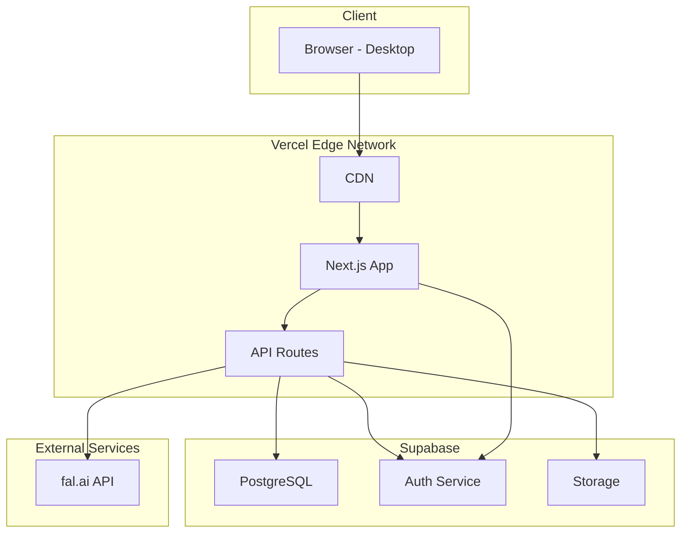
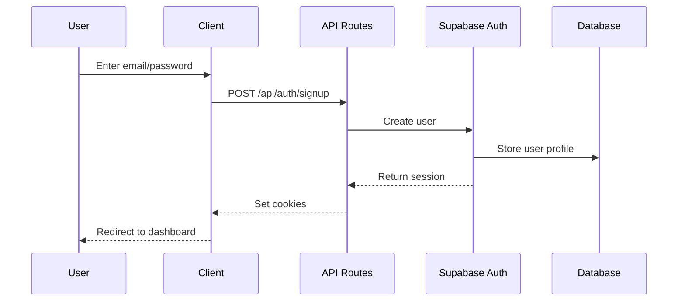
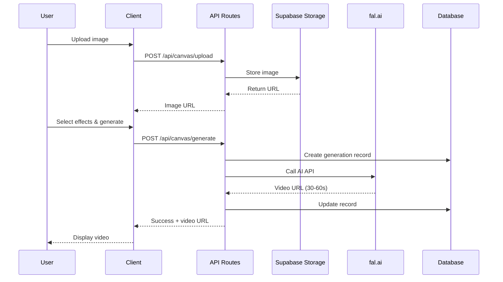
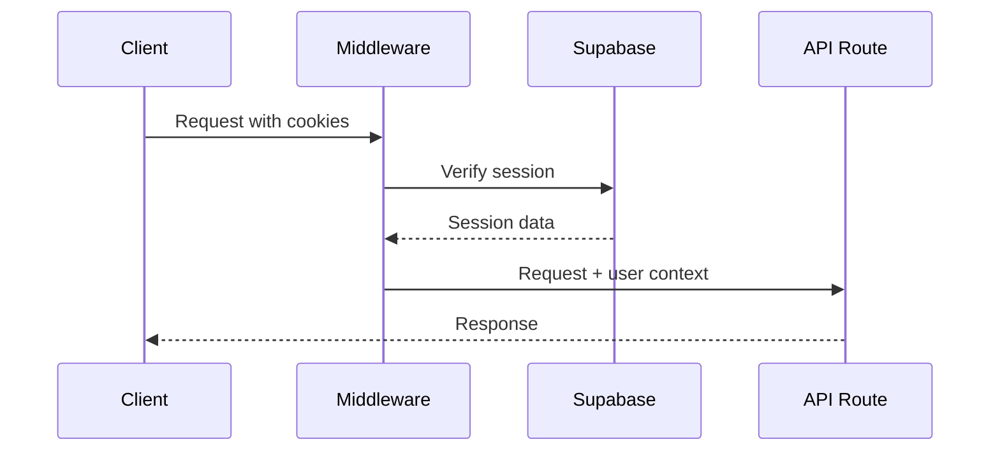
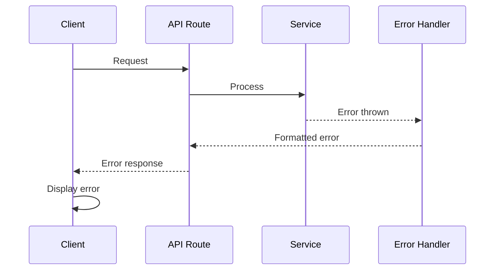

# VogueDrop Fullstack Architecture Document

## Introduction

This document outlines the complete fullstack architecture for VogueDrop MVP, including backend systems, frontend implementation, and their integration. It serves as the single source of truth for AI-driven development, ensuring consistency across the entire technology stack.

This unified approach combines what would traditionally be separate backend and frontend architecture documents, streamlining the development process for modern fullstack applications where these concerns are increasingly intertwined.

### Starter Template or Existing Project
N/A - Greenfield project with existing partial implementation

### Change Log
| Date | Version | Description | Author |
|------|---------|-------------|---------|
| 2025-01-30 | 1.0 | Initial architecture document | BMad Master |

## High Level Architecture

### Technical Summary
VogueDrop is a serverless fullstack application built with Next.js 14+ and deployed on Vercel, utilizing Supabase for authentication, database, and storage. The architecture follows a Jamstack pattern with server-side rendering for optimal performance and SEO. Frontend and backend are tightly integrated through Next.js API Routes, providing a seamless development experience. The system integrates with fal.ai for AI video generation capabilities. This architecture enables rapid MVP development while maintaining scalability for future growth.

### Platform and Infrastructure Choice
**Platform:** Vercel + Supabase
**Key Services:** 
- Vercel (Hosting, Edge Functions, CDN)
- Supabase (PostgreSQL, Auth, Storage, Realtime)
- fal.ai (AI Video Generation)
**Deployment Host and Regions:** Vercel Global Edge Network (Auto-scaling)

### Repository Structure
**Structure:** Monorepo
**Monorepo Tool:** npm workspaces (built into npm 7+)
**Package Organization:** Feature-based co-location within Next.js app directory

### High Level Architecture Diagram



### Architectural Patterns
- **Jamstack Architecture:** Static generation with dynamic API routes - _Rationale:_ Optimal performance for content-heavy pages with dynamic user data
- **Feature-First Co-location:** Components, hooks, and utilities organized by feature - _Rationale:_ Better maintainability and developer experience for small teams
- **Server Components (RSC):** React Server Components for data fetching - _Rationale:_ Reduced client bundle size and improved initial page load
- **API Route Handlers:** Next.js 14 route handlers for backend logic - _Rationale:_ Simplified backend development without separate server
- **Optimistic UI Updates:** Client-side state updates before server confirmation - _Rationale:_ Better perceived performance for AI generation workflows

## Tech Stack

### Technology Stack Table
| Category | Technology | Version | Purpose | Rationale |
|----------|------------|---------|---------|-----------|
| Frontend Language | TypeScript | 5.3+ | Type-safe frontend development | Prevents runtime errors, better IDE support |
| Frontend Framework | Next.js | 14.2+ | React framework with SSR/SSG | Full-stack capabilities, Vercel optimization |
| UI Component Library | Tailwind CSS | 3.4+ | Utility-first CSS | Rapid UI development, consistent styling |
| State Management | Zustand | 4.5+ | Client state management | Simple API, TypeScript support, small bundle |
| Backend Language | TypeScript | 5.3+ | Type-safe backend development | Shared types with frontend |
| Backend Framework | Next.js API Routes | 14.2+ | Serverless API endpoints | Integrated with frontend, automatic scaling |
| API Style | REST | - | HTTP API design | Simple, well-understood, fits use case |
| Database | PostgreSQL | 15+ | Primary data store | Relational data, Supabase integration |
| Cache | Vercel Edge Cache | - | CDN caching | Automatic caching, no setup required |
| File Storage | Supabase Storage | - | Media file storage | Integrated auth, direct browser uploads |
| Authentication | Supabase Auth | 2.0+ | User authentication | Built-in email/password, session management |
| Frontend Testing | Vitest | 1.2+ | Unit testing | Fast, Jest-compatible, ESM support |
| Backend Testing | Vitest | 1.2+ | API testing | Same as frontend for consistency |
| E2E Testing | Playwright | 1.40+ | End-to-end testing | Cross-browser support, reliable |
| Build Tool | Next.js CLI | 14.2+ | Build orchestration | Integrated with framework |
| Bundler | Turbopack | Beta | Fast bundling | Next.js integration, fast HMR |
| IaC Tool | N/A | - | Infrastructure as Code | Using platform services, no custom infra |
| CI/CD | GitHub Actions | - | Continuous integration | Free for public repos, Vercel integration |
| Monitoring | Vercel Analytics | - | Performance monitoring | Built-in, zero config |
| Logging | Vercel Functions Logs | - | Application logging | Automatic, integrated with platform |
| CSS Framework | Tailwind CSS | 3.4+ | Styling system | Utility classes, tree-shaking |

## Data Models

### User
**Purpose:** Represents authenticated users of the platform

**Key Attributes:**
- id: uuid - Unique identifier from Supabase Auth
- email: string - User's email address
- created_at: timestamp - Account creation time
- updated_at: timestamp - Last profile update

**TypeScript Interface:**
```typescript
interface User {
  id: string;
  email: string;
  created_at: string;
  updated_at: string;
}
```

**Relationships:**
- Has many VideoGenerations
- Has many Projects (future)

### Category
**Purpose:** Categorizes effects for video generation (effect, camera, model)

**Key Attributes:**
- id: bigint - Unique identifier
- name: string - Category name (unique)
- created_at: timestamp - Creation time

**TypeScript Interface:**
```typescript
interface Category {
  id: string;
  name: 'effect' | 'camera' | 'model';
  created_at: string;
}
```

**Relationships:**
- Has many EffectTemplates

### EffectTemplate
**Purpose:** Pre-defined effects/prompts for video generation

**Key Attributes:**
- id: bigint - Unique identifier
- name: string - Display name
- category_id: bigint - Reference to category
- prompt: string - AI prompt text
- preview_media_id: bigint? - Preview image/video
- display_order: number - UI ordering
- is_active: boolean - Enable/disable flag

**TypeScript Interface:**
```typescript
interface EffectTemplate {
  id: string;
  name: string;
  category_id: string;
  category?: Category;
  prompt: string;
  preview_media_id?: string;
  preview_media?: MediaAsset;
  display_order: number;
  is_active: boolean;
  created_at: string;
}
```

**Relationships:**
- Belongs to Category
- Has optional MediaAsset for preview

### MediaAsset
**Purpose:** Stores references to uploaded media files

**Key Attributes:**
- id: bigint - Unique identifier
- storage_path: string - Supabase storage path (unique)
- file_name: string? - Original filename
- media_type: string? - MIME type
- created_at: timestamp - Upload time

**TypeScript Interface:**
```typescript
interface MediaAsset {
  id: string;
  storage_path: string;
  file_name?: string;
  media_type?: string;
  created_at: string;
  public_url?: string; // Computed field
}
```

**Relationships:**
- Referenced by EffectTemplates
- Referenced by VideoGenerations (future)

### VideoGeneration
**Purpose:** Tracks AI video generation requests and results

**Key Attributes:**
- id: bigint - Unique identifier
- user_id: string - User ID or 'anonymous'
- source_image_url: string - Uploaded image URL
- selected_effects: jsonb - Array of selected effect IDs
- combined_prompt: string - Final prompt sent to AI
- model_type: string - 'seedance' or 'hailo'
- status: string - pending/processing/completed/failed
- result_video_url: string? - Generated video URL
- error_message: string? - Error details if failed
- created_at: timestamp - Generation time

**TypeScript Interface:**
```typescript
interface VideoGeneration {
  id: string;
  user_id: string;
  source_image_url: string;
  selected_effects: string[];
  combined_prompt: string;
  model_type: 'seedance' | 'hailo';
  status: 'pending' | 'processing' | 'completed' | 'failed';
  result_video_url?: string;
  error_message?: string;
  created_at: string;
}
```

**Relationships:**
- Belongs to User (if authenticated)
- References EffectTemplates (via selected_effects)

## API Specification

### REST API Specification

```yaml
openapi: 3.0.0
info:
  title: VogueDrop API
  version: 1.0.0
  description: API for AI video generation and editing
servers:
  - url: https://voguedrop.vercel.app/api
    description: Production API

paths:
  /auth/signup:
    post:
      summary: Create new user account
      requestBody:
        required: true
        content:
          application/json:
            schema:
              type: object
              properties:
                email:
                  type: string
                password:
                  type: string
      responses:
        200:
          description: User created successfully
          
  /auth/login:
    post:
      summary: Login user
      requestBody:
        required: true
        content:
          application/json:
            schema:
              type: object
              properties:
                email:
                  type: string
                password:
                  type: string
      responses:
        200:
          description: Login successful
          
  /auth/logout:
    post:
      summary: Logout user
      responses:
        200:
          description: Logout successful
          
  /canvas/effects:
    get:
      summary: Get all effect templates
      parameters:
        - name: category
          in: query
          schema:
            type: string
            enum: [effect, camera, model]
      responses:
        200:
          description: List of effect templates
          content:
            application/json:
              schema:
                type: array
                items:
                  $ref: '#/components/schemas/EffectTemplate'
                  
  /canvas/upload:
    post:
      summary: Upload image for generation
      requestBody:
        required: true
        content:
          multipart/form-data:
            schema:
              type: object
              properties:
                file:
                  type: string
                  format: binary
      responses:
        200:
          description: Upload successful
          content:
            application/json:
              schema:
                type: object
                properties:
                  url:
                    type: string
                    
  /canvas/generate:
    post:
      summary: Generate AI video
      requestBody:
        required: true
        content:
          application/json:
            schema:
              type: object
              properties:
                imageUrl:
                  type: string
                selectedEffects:
                  type: array
                  items:
                    type: string
                modelType:
                  type: string
                  enum: [seedance, hailo]
      responses:
        200:
          description: Generation started
          content:
            application/json:
              schema:
                type: object
                properties:
                  generationId:
                    type: string
                  videoUrl:
                    type: string
                    
  /canvas/history:
    get:
      summary: Get user's generation history
      parameters:
        - name: page
          in: query
          schema:
            type: integer
            default: 1
        - name: limit
          in: query
          schema:
            type: integer
            default: 20
      responses:
        200:
          description: List of generations
          content:
            application/json:
              schema:
                type: object
                properties:
                  data:
                    type: array
                    items:
                      $ref: '#/components/schemas/VideoGeneration'
                  total:
                    type: integer
                  page:
                    type: integer
                    
  /editor/export:
    post:
      summary: Export edited video
      requestBody:
        required: true
        content:
          application/json:
            schema:
              type: object
              properties:
                timeline:
                  type: object
                quality:
                  type: string
                  enum: [720p, 1080p]
      responses:
        200:
          description: Export started
          content:
            application/json:
              schema:
                type: object
                properties:
                  exportUrl:
                    type: string

components:
  schemas:
    EffectTemplate:
      type: object
      properties:
        id:
          type: string
        name:
          type: string
        category:
          type: string
        prompt:
          type: string
        preview_url:
          type: string
          
    VideoGeneration:
      type: object
      properties:
        id:
          type: string
        source_image_url:
          type: string
        result_video_url:
          type: string
        status:
          type: string
        created_at:
          type: string
```

## Components

### Frontend Application
**Responsibility:** Next.js application serving UI and handling client-side logic

**Key Interfaces:**
- Server Components for initial page renders
- Client Components for interactive features
- API client services for backend communication

**Dependencies:** Supabase Auth SDK, fal.ai client

**Technology Stack:** Next.js 14+, React 18+, TypeScript, Tailwind CSS

### API Routes
**Responsibility:** Serverless backend endpoints handling business logic

**Key Interfaces:**
- REST endpoints for all operations
- Middleware for authentication
- Error handling and validation

**Dependencies:** Supabase Admin SDK, fal.ai SDK

**Technology Stack:** Next.js API Routes, TypeScript

### Canvas AI Service
**Responsibility:** Manages AI video generation workflow

**Key Interfaces:**
- POST /api/canvas/generate
- GET /api/canvas/effects
- POST /api/canvas/upload

**Dependencies:** Supabase Storage, fal.ai API

**Technology Stack:** TypeScript, fal.ai SDK

### Video Editor Service
**Responsibility:** Handles video editing operations

**Key Interfaces:**
- Timeline manipulation APIs
- Export functionality
- Media management

**Dependencies:** FFmpeg.wasm (client-side)

**Technology Stack:** TypeScript, FFmpeg.wasm

### Authentication Service
**Responsibility:** User authentication and session management

**Key Interfaces:**
- Supabase Auth integration
- Session middleware
- Protected route handling

**Dependencies:** Supabase Auth

**Technology Stack:** Supabase Auth SDK, Next.js middleware

## External APIs

### fal.ai API
- **Purpose:** AI video generation from images
- **Documentation:** https://fal.ai/docs
- **Base URL(s):** https://api.fal.ai
- **Authentication:** API Key (Bearer token)
- **Rate Limits:** Based on subscription tier

**Key Endpoints Used:**
- `POST /fal-ai/fast-sdxl/image-to-video` - Generate video from image

**Integration Notes:** Handle timeout scenarios, implement retry logic for failed generations

## Core Workflows

### User Registration and Login Flow


### AI Video Generation Flow


## Database Schema

```sql
-- Users table managed by Supabase Auth
-- Reference via auth.users

-- Categories for effects
CREATE TABLE public.categories (
  id bigint GENERATED ALWAYS AS IDENTITY PRIMARY KEY,
  name text NOT NULL UNIQUE,
  created_at timestamp with time zone DEFAULT now()
);

-- Effect templates
CREATE TABLE public.effect_templates (
  id bigint GENERATED ALWAYS AS IDENTITY PRIMARY KEY,
  name text NOT NULL,
  category_id bigint NOT NULL REFERENCES categories(id),
  prompt text NOT NULL,
  preview_media_id bigint REFERENCES media_assets(id),
  display_order integer DEFAULT 0,
  is_active boolean DEFAULT true,
  created_at timestamp with time zone DEFAULT now()
);

-- Media assets storage references
CREATE TABLE public.media_assets (
  id bigint GENERATED ALWAYS AS IDENTITY PRIMARY KEY,
  storage_path text NOT NULL UNIQUE,
  file_name text,
  media_type text,
  created_at timestamp with time zone DEFAULT now()
);

-- Video generation history
CREATE TABLE public.video_generations (
  id bigint GENERATED ALWAYS AS IDENTITY PRIMARY KEY,
  user_id text NOT NULL DEFAULT 'anonymous',
  source_image_url text NOT NULL,
  selected_effects jsonb NOT NULL,
  combined_prompt text NOT NULL,
  model_type text NOT NULL CHECK (model_type IN ('seedance', 'hailo')),
  status text NOT NULL DEFAULT 'pending' CHECK (status IN ('pending', 'processing', 'completed', 'failed')),
  result_video_url text,
  error_message text,
  created_at timestamp with time zone DEFAULT now()
);

-- Indexes for performance
CREATE INDEX idx_video_generations_user_id ON video_generations(user_id);
CREATE INDEX idx_video_generations_status ON video_generations(status);
CREATE INDEX idx_effect_templates_category ON effect_templates(category_id);
```

## Frontend Architecture

### Component Architecture

#### Component Organization
```
app/
├── (auth)/
│   ├── login/
│   │   └── page.tsx
│   └── signup/
│       └── page.tsx
├── (app)/
│   ├── canvas/
│   │   ├── _components/
│   │   │   ├── ImageUpload.tsx
│   │   │   ├── EffectSelector.tsx
│   │   │   ├── VideoPreview.tsx
│   │   │   └── GenerationHistory.tsx
│   │   └── page.tsx
│   ├── history/
│   │   └── page.tsx
│   └── editor/
│       ├── _components/
│       │   ├── Timeline.tsx
│       │   ├── VideoControls.tsx
│       │   └── ExportDialog.tsx
│       └── page.tsx
├── _components/
│   ├── ui/              # Shared UI components
│   └── layout/          # Layout components
└── api/                 # API routes
```

#### Component Template
```typescript
// Example component structure
import { FC } from 'react';

interface ComponentProps {
  // Props definition
}

export const Component: FC<ComponentProps> = ({ ...props }) => {
  // Component logic
  
  return (
    <div className="...">
      {/* Component JSX */}
    </div>
  );
};
```

### State Management Architecture

#### State Structure
```typescript
// stores/canvas.store.ts
interface CanvasState {
  uploadedImage: string | null;
  selectedEffects: string[];
  isGenerating: boolean;
  generatedVideos: VideoGeneration[];
  
  // Actions
  setUploadedImage: (url: string) => void;
  toggleEffect: (effectId: string) => void;
  generateVideo: () => Promise<void>;
}

// stores/editor.store.ts
interface EditorState {
  timeline: TimelineItem[];
  currentTime: number;
  isPlaying: boolean;
  
  // Actions
  addToTimeline: (item: TimelineItem) => void;
  updateTimeline: (items: TimelineItem[]) => void;
  exportVideo: (quality: string) => Promise<string>;
}
```

#### State Management Patterns
- Use Zustand for global client state
- Server state handled by React Query (future)
- Form state with react-hook-form
- URL state with Next.js router

### Routing Architecture

#### Route Organization
```
app/
├── (auth)/          # Auth layout group
│   ├── layout.tsx   # Public layout
│   ├── login/
│   └── signup/
├── (app)/           # Protected layout group
│   ├── layout.tsx   # Authenticated layout
│   ├── canvas/
│   ├── history/
│   └── editor/
└── api/             # API routes
```

#### Protected Route Pattern
```typescript
// app/(app)/layout.tsx
import { createServerComponentClient } from '@supabase/auth-helpers-nextjs';
import { redirect } from 'next/navigation';

export default async function ProtectedLayout({
  children
}: {
  children: React.ReactNode;
}) {
  const supabase = createServerComponentClient({ cookies });
  const { data: { session } } = await supabase.auth.getSession();
  
  if (!session) {
    redirect('/login');
  }
  
  return <>{children}</>;
}
```

### Frontend Services Layer

#### API Client Setup
```typescript
// lib/api-client.ts
class ApiClient {
  private baseUrl = '/api';
  
  async request<T>(
    endpoint: string,
    options?: RequestInit
  ): Promise<T> {
    const response = await fetch(`${this.baseUrl}${endpoint}`, {
      ...options,
      headers: {
        'Content-Type': 'application/json',
        ...options?.headers,
      },
    });
    
    if (!response.ok) {
      throw new Error(`API Error: ${response.statusText}`);
    }
    
    return response.json();
  }
}

export const api = new ApiClient();
```

#### Service Example
```typescript
// services/canvas.service.ts
export const canvasService = {
  async uploadImage(file: File): Promise<{ url: string }> {
    const formData = new FormData();
    formData.append('file', file);
    
    const response = await fetch('/api/canvas/upload', {
      method: 'POST',
      body: formData,
    });
    
    return response.json();
  },
  
  async generateVideo(params: GenerateParams): Promise<VideoGeneration> {
    return api.request('/canvas/generate', {
      method: 'POST',
      body: JSON.stringify(params),
    });
  },
  
  async getEffects(category?: string): Promise<EffectTemplate[]> {
    const query = category ? `?category=${category}` : '';
    return api.request(`/canvas/effects${query}`);
  }
};
```

## Backend Architecture

### Service Architecture

#### Function Organization
```
app/api/
├── auth/
│   ├── signup/
│   │   └── route.ts
│   ├── login/
│   │   └── route.ts
│   └── logout/
│       └── route.ts
├── canvas/
│   ├── effects/
│   │   └── route.ts
│   ├── upload/
│   │   └── route.ts
│   ├── generate/
│   │   └── route.ts
│   └── history/
│       └── route.ts
└── editor/
    └── export/
        └── route.ts
```

#### Function Template
```typescript
// app/api/canvas/generate/route.ts
import { NextRequest, NextResponse } from 'next/server';
import { createRouteHandlerClient } from '@supabase/auth-helpers-nextjs';
import { cookies } from 'next/headers';

export async function POST(request: NextRequest) {
  try {
    const supabase = createRouteHandlerClient({ cookies });
    
    // Check authentication
    const { data: { session } } = await supabase.auth.getSession();
    const userId = session?.user?.id || 'anonymous';
    
    // Parse request body
    const body = await request.json();
    
    // Business logic
    const result = await generateVideo(body, userId);
    
    return NextResponse.json(result);
  } catch (error) {
    return NextResponse.json(
      { error: 'Internal server error' },
      { status: 500 }
    );
  }
}
```

### Database Architecture

#### Data Access Layer
```typescript
// lib/db/repositories/video-generation.repository.ts
export class VideoGenerationRepository {
  constructor(private supabase: SupabaseClient) {}
  
  async create(data: Partial<VideoGeneration>) {
    const { data: generation, error } = await this.supabase
      .from('video_generations')
      .insert(data)
      .select()
      .single();
      
    if (error) throw error;
    return generation;
  }
  
  async updateStatus(id: string, status: string, videoUrl?: string) {
    const { error } = await this.supabase
      .from('video_generations')
      .update({ 
        status, 
        result_video_url: videoUrl,
        updated_at: new Date().toISOString()
      })
      .eq('id', id);
      
    if (error) throw error;
  }
  
  async getUserHistory(userId: string, page = 1, limit = 20) {
    const start = (page - 1) * limit;
    
    const { data, error, count } = await this.supabase
      .from('video_generations')
      .select('*', { count: 'exact' })
      .eq('user_id', userId)
      .order('created_at', { ascending: false })
      .range(start, start + limit - 1);
      
    if (error) throw error;
    
    return {
      data,
      total: count || 0,
      page,
      limit
    };
  }
}
```

### Authentication and Authorization

#### Auth Flow


#### Middleware/Guards
```typescript
// middleware.ts
import { createMiddlewareClient } from '@supabase/auth-helpers-nextjs';
import { NextResponse } from 'next/server';
import type { NextRequest } from 'next/server';

export async function middleware(req: NextRequest) {
  const res = NextResponse.next();
  const supabase = createMiddlewareClient({ req, res });
  
  const {
    data: { session },
  } = await supabase.auth.getSession();
  
  // Protect /app routes
  if (req.nextUrl.pathname.startsWith('/app') && !session) {
    return NextResponse.redirect(new URL('/login', req.url));
  }
  
  return res;
}

export const config = {
  matcher: ['/app/:path*', '/api/:path*']
};
```

## Unified Project Structure

```
voguedrop/
├── .github/
│   └── workflows/
│       ├── ci.yaml
│       └── deploy.yaml
├── app/                        # Next.js app directory
│   ├── (auth)/                 # Auth routes group
│   │   ├── login/
│   │   └── signup/
│   ├── (app)/                  # Protected routes group
│   │   ├── canvas/
│   │   ├── history/
│   │   └── editor/
│   ├── api/                    # API routes
│   │   ├── auth/
│   │   ├── canvas/
│   │   └── editor/
│   ├── _components/            # Shared components
│   │   ├── ui/
│   │   └── layout/
│   ├── layout.tsx
│   └── page.tsx
├── lib/                        # Shared utilities
│   ├── api/                    # API clients
│   ├── db/                     # Database utilities
│   ├── supabase/              # Supabase config
│   └── utils/                  # Helper functions
├── stores/                     # Zustand stores
│   ├── canvas.store.ts
│   └── editor.store.ts
├── types/                      # TypeScript types
│   ├── database.ts
│   └── api.ts
├── public/                     # Static assets
├── docs/                       # Documentation
│   ├── prd.md
│   └── fullstack-architecture.md
├── .env.example
├── package.json
├── tsconfig.json
├── tailwind.config.js
├── next.config.js
└── README.md
```

## Development Workflow

### Local Development Setup

#### Prerequisites
```bash
# Required software
node >= 18.0.0
npm >= 9.0.0
git

# Supabase CLI (optional)
brew install supabase/tap/supabase
```

#### Initial Setup
```bash
# Clone repository
git clone https://github.com/your-org/voguedrop.git
cd voguedrop

# Install dependencies
npm install

# Copy environment variables
cp .env.example .env.local

# Run database migrations (if using Supabase CLI)
supabase db push

# Seed initial data
npm run db:seed
```

#### Development Commands
```bash
# Start all services
npm run dev

# Start frontend only
npm run dev:frontend

# Start backend only
npm run dev:api

# Run tests
npm test
npm run test:e2e
```

### Environment Configuration

#### Required Environment Variables
```bash
# Frontend (.env.local)
NEXT_PUBLIC_SUPABASE_URL=your-project-url
NEXT_PUBLIC_SUPABASE_ANON_KEY=your-anon-key

# Backend (.env)
SUPABASE_SERVICE_KEY=your-service-key
FAL_API_KEY=your-fal-api-key

# Shared
DATABASE_URL=postgresql://...
```

## Deployment Architecture

### Deployment Strategy

**Frontend Deployment:**
- **Platform:** Vercel
- **Build Command:** `npm run build`
- **Output Directory:** `.next`
- **CDN/Edge:** Vercel Edge Network

**Backend Deployment:**
- **Platform:** Vercel (Serverless Functions)
- **Build Command:** Included in frontend build
- **Deployment Method:** Automatic with frontend

### CI/CD Pipeline
```yaml
# .github/workflows/deploy.yaml
name: Deploy to Vercel

on:
  push:
    branches: [main]
  pull_request:
    branches: [main]

jobs:
  deploy:
    runs-on: ubuntu-latest
    steps:
      - uses: actions/checkout@v3
      
      - name: Setup Node.js
        uses: actions/setup-node@v3
        with:
          node-version: '18'
          
      - name: Install dependencies
        run: npm ci
        
      - name: Run tests
        run: npm test
        
      - name: Build
        run: npm run build
        
      - name: Deploy to Vercel
        uses: vercel/action@v2
        with:
          vercel-token: ${{ secrets.VERCEL_TOKEN }}
```

### Environments
| Environment | Frontend URL | Backend URL | Purpose |
|-------------|-------------|-------------|---------|
| Development | http://localhost:3000 | http://localhost:3000/api | Local development |
| Staging | https://voguedrop-staging.vercel.app | https://voguedrop-staging.vercel.app/api | Pre-production testing |
| Production | https://voguedrop.vercel.app | https://voguedrop.vercel.app/api | Live environment |

## Security and Performance

### Security Requirements

**Frontend Security:**
- CSP Headers: Default Next.js CSP with modifications for Supabase
- XSS Prevention: React's built-in escaping, sanitize user inputs
- Secure Storage: HTTPOnly cookies for auth tokens

**Backend Security:**
- Input Validation: Zod schemas for all API inputs
- Rate Limiting: Vercel's built-in rate limiting (60 req/min)
- CORS Policy: Restricted to application domain

**Authentication Security:**
- Token Storage: Supabase handles securely
- Session Management: 7-day refresh, 1-hour access tokens
- Password Policy: Minimum 8 characters, Supabase defaults

### Performance Optimization

**Frontend Performance:**
- Bundle Size Target: < 200KB initial JS
- Loading Strategy: Code splitting, lazy loading for editor
- Caching Strategy: SWR for data fetching, browser cache for assets

**Backend Performance:**
- Response Time Target: < 200ms for reads, < 1s for writes
- Database Optimization: Indexes on foreign keys and filters
- Caching Strategy: Vercel Edge Cache for static data

## Testing Strategy

### Testing Pyramid
```
         E2E Tests
        /        \
   Integration Tests
      /            \
 Frontend Unit  Backend Unit
```

### Test Organization

#### Frontend Tests
```
app/
├── (app)/
│   └── canvas/
│       └── _components/
│           └── __tests__/
│               └── EffectSelector.test.tsx
tests/
├── unit/
└── integration/
```

#### Backend Tests
```
app/
└── api/
    └── canvas/
        └── generate/
            └── __tests__/
                └── route.test.ts
```

#### E2E Tests
```
e2e/
├── auth.spec.ts
├── canvas.spec.ts
└── editor.spec.ts
```

### Test Examples

#### Frontend Component Test
```typescript
// EffectSelector.test.tsx
import { render, screen, fireEvent } from '@testing-library/react';
import { EffectSelector } from '../EffectSelector';

describe('EffectSelector', () => {
  it('should limit selection to 4 effects', () => {
    const effects = Array.from({ length: 6 }, (_, i) => ({
      id: `${i}`,
      name: `Effect ${i}`,
      // ...
    }));
    
    render(<EffectSelector effects={effects} />);
    
    // Select 5 effects
    for (let i = 0; i < 5; i++) {
      fireEvent.click(screen.getByText(`Effect ${i}`));
    }
    
    // Only 4 should be selected
    const selected = screen.getAllByRole('checkbox', { checked: true });
    expect(selected).toHaveLength(4);
  });
});
```

#### Backend API Test
```typescript
// generate/route.test.ts
import { POST } from '../route';
import { NextRequest } from 'next/server';

describe('POST /api/canvas/generate', () => {
  it('should create video generation', async () => {
    const request = new NextRequest('http://localhost/api/canvas/generate', {
      method: 'POST',
      body: JSON.stringify({
        imageUrl: 'https://example.com/image.jpg',
        selectedEffects: ['1', '2'],
        modelType: 'seedance'
      })
    });
    
    const response = await POST(request);
    const data = await response.json();
    
    expect(response.status).toBe(200);
    expect(data).toHaveProperty('generationId');
  });
});
```

#### E2E Test
```typescript
// canvas.spec.ts
import { test, expect } from '@playwright/test';

test('complete video generation flow', async ({ page }) => {
  // Login
  await page.goto('/login');
  await page.fill('[name="email"]', 'test@example.com');
  await page.fill('[name="password"]', 'password');
  await page.click('button[type="submit"]');
  
  // Navigate to canvas
  await page.goto('/canvas');
  
  // Upload image
  const fileInput = page.locator('input[type="file"]');
  await fileInput.setInputFiles('test-image.jpg');
  
  // Select effects
  await page.click('[data-effect-id="1"]');
  await page.click('[data-effect-id="2"]');
  
  // Generate
  await page.click('button:has-text("Generate")');
  
  // Wait for video
  await expect(page.locator('video')).toBeVisible({ timeout: 60000 });
});
```

## Coding Standards

### Critical Fullstack Rules
- **Type Sharing:** Always define types in types/ directory and import from there
- **API Calls:** Never make direct HTTP calls - use the service layer
- **Environment Variables:** Access only through config objects, never process.env directly
- **Error Handling:** All API routes must return consistent error format
- **State Updates:** Use Zustand actions, never mutate state directly
- **Database Access:** Always use repository pattern, no direct Supabase calls in routes

### Naming Conventions
| Element | Frontend | Backend | Example |
|---------|----------|---------|---------|
| Components | PascalCase | - | `EffectSelector.tsx` |
| Hooks | camelCase with 'use' | - | `useVideoGeneration.ts` |
| API Routes | - | kebab-case | `/api/canvas/generate` |
| Database Tables | - | snake_case | `video_generations` |

## Error Handling Strategy

### Error Flow


### Error Response Format
```typescript
interface ApiError {
  error: {
    code: string;
    message: string;
    details?: Record<string, any>;
    timestamp: string;
    requestId: string;
  };
}
```

### Frontend Error Handling
```typescript
// lib/error-handler.ts
export function handleApiError(error: unknown): string {
  if (error instanceof ApiError) {
    return error.message;
  }
  
  if (error instanceof Error) {
    return error.message;
  }
  
  return 'An unexpected error occurred';
}

// Usage in component
try {
  await canvasService.generateVideo(params);
} catch (error) {
  toast.error(handleApiError(error));
}
```

### Backend Error Handling
```typescript
// lib/api/error-handler.ts
export class ApiError extends Error {
  constructor(
    public code: string,
    public statusCode: number,
    message: string,
    public details?: any
  ) {
    super(message);
  }
}

export function errorResponse(error: unknown): NextResponse {
  const requestId = crypto.randomUUID();
  
  if (error instanceof ApiError) {
    return NextResponse.json({
      error: {
        code: error.code,
        message: error.message,
        details: error.details,
        timestamp: new Date().toISOString(),
        requestId
      }
    }, { status: error.statusCode });
  }
  
  // Log unexpected errors
  console.error(`[${requestId}]`, error);
  
  return NextResponse.json({
    error: {
      code: 'INTERNAL_ERROR',
      message: 'An unexpected error occurred',
      timestamp: new Date().toISOString(),
      requestId
    }
  }, { status: 500 });
}
```

## Monitoring and Observability

### Monitoring Stack
- **Frontend Monitoring:** Vercel Analytics + Web Vitals
- **Backend Monitoring:** Vercel Functions Logs
- **Error Tracking:** Sentry (future enhancement)
- **Performance Monitoring:** Vercel Speed Insights

### Key Metrics

**Frontend Metrics:**
- Core Web Vitals
- JavaScript errors
- API response times
- User interactions

**Backend Metrics:**
- Request rate
- Error rate
- Response time
- Database query performance

## Next Steps

This architecture document provides the foundation for VogueDrop MVP development. The next steps are:

1. **Architecture Review:** Review this document for completeness
2. **Frontend Architecture:** Create detailed frontend architecture document
3. **Implementation:** Begin Epic 1 development following this architecture
4. **Monitoring:** Set up basic monitoring from day one