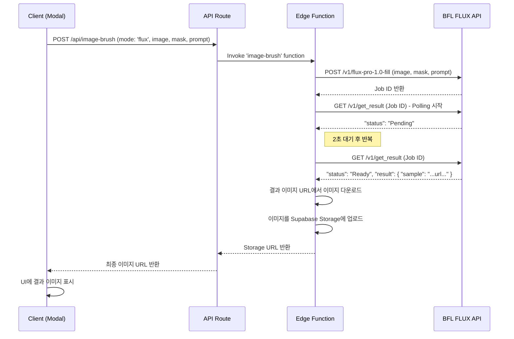

# 기능: 이미지 브러시 - FLUX 모드 (인페인팅)

## 1. 개요
FLUX 모드는 Image Brush 기능의 핵심 중 하나로, 사용자가 지정한 마스크 영역을 입력한 프롬프트에 따라 자연스럽게 채워넣는 인페인팅(Inpainting) 기능입니다. 이 기능은 BlackForestLabs(BFL)의 FLUX Fill API를 사용합니다.

## 2. 핵심 파일
- **프론트엔드**: `src/app/canvas/_components/ImageBrushModal.tsx` (UI 및 요청 시작)
- **API 프록시**: `src/app/api/canvas/image-brush/route.ts` (인증 및 요청 전달)
- **핵심 로직 (Edge Function)**: `supabase/functions/image-brush/index.ts`
- **관련 문서**: `docs/features/image_brush.md` (BFL API 사용법)

## 3. 워크플로우

## 4. 주요 로직 설명 (Edge Function)

### 1. BFL API 호출 (`callFluxFillAPI`)
- **위치**: `supabase/functions/image-brush/index.ts`
- **요청 본문**: BFL API는 `image`, `mask`, `prompt`를 Base64 문자열로 받습니다. 프론트엔드에서 받은 데이터를 그대로 사용합니다.
- **인증**: `X-Key` 헤더에 `BFL_TOKEN` 환경 변수(Secret)를 담아 전송합니다.

### 2. 결과 폴링 (`pollForResult`)
- BFL API는 비동기적으로 작동하므로, 작업 ID를 받은 후 결과가 준비될 때까지 주기적으로 상태를 확인해야 합니다.
- `while (true)` 루프와 `setTimeout`을 사용하여 2초 간격으로 `get_result` 엔드포인트를 호출합니다.
- **상태 처리**:
  - `Pending`: 계속 폴링합니다.
  - `Ready`: 루프를 중단하고 결과 이미지 URL을 반환합니다.
  - `Error` 또는 `Task not found`: 에러를 발생시키고 프로세스를 중단합니다.
- **타임아웃**: 최대 폴링 횟수(예: 60회, 2분)를 설정하여 무한 루프를 방지합니다.

### 3. 결과 처리
- BFL API에서 받은 결과 이미지 URL은 임시 URL일 수 있으므로, 해당 URL에서 이미지를 다운로드합니다 (`fetch`).
- 다운로드한 이미지를 영구적으로 보관하기 위해 Supabase Storage에 업로드합니다.
- 최종적으로 클라이언트에게는 Supabase Storage의 공개 URL을 반환합니다.

## 5. 환경 변수
- **`BFL_TOKEN`**: BlackForestLabs API 토큰. Supabase Edge Function의 Secrets에 안전하게 저장되어야 합니다.

## 6. 트러블슈팅
- **`401 Unauthorized` 에러**: `BFL_TOKEN`이 잘못되었거나 만료되었을 가능성이 높습니다. Supabase Secrets를 확인하세요.
- **`Task not found` 에러**: BFL 서버에서 작업이 유실되었을 수 있습니다. 재시도 로직을 구현하거나 사용자에게 재시도를 유도해야 합니다.
- **결과 이미지 품질 저하**: BFL API의 파라미터(`guidance`, `prompt_upsampling` 등)를 조정하여 품질을 개선할 수 있습니다. 현재는 기본값을 사용하고 있습니다.
