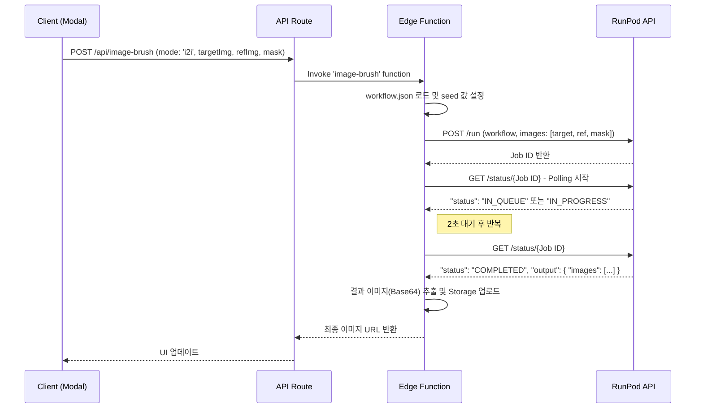

# 기능: 이미지 브러시 - I2I 모드 (스타일 전송)

## 1. 개요
I2I(Image-to-Image) 모드는 참조(Reference) 이미지의 스타일, 질감, 패턴을 타겟 이미지의 마스크된 영역에 적용하는 고급 기능입니다. 이 기능은 RunPod에서 실행되는 커스텀 ComfyUI 워크플로우를 통해 구현됩니다.

## 2. 핵심 파일
- **프론트엔드**: `src/app/canvas/_components/ImageBrushModal.tsx` (참조 이미지 업로드 UI)
- **API 프록시**: `src/app/api/canvas/image-brush/route.ts`
- **핵심 로직 (Edge Function)**: `supabase/functions/image-brush/index.ts`
- **ComfyUI 워크플로우**: `supabase/functions/image-brush/workflow.json`
- **관련 문서**:
  - `docs/features/runpod-i2i-integration.md`
  - `docs/task/task_i2i_implementation.md`

## 3. 워크플로우

## 4. 주요 로직 설명

### 1. ComfyUI 워크플로우 (`workflow.json`)
- 이 JSON 파일은 RunPod에서 실행될 노드 기반 파이프라인을 정의합니다.
- **주요 노드**:
  - `LoadImage` (x3): 타겟, 참조, 마스크 이미지를 로드합니다. `name` 필드(e.g., `input-1.png`)가 Edge Function에서 전송하는 이미지 이름과 일치해야 합니다.
  - `StyleModelApply`: 참조 이미지에서 스타일을 추출하여 타겟 이미지에 적용하는 핵심 노드. `strength` 값을 조절하여 스타일 적용 강도를 제어할 수 있습니다.
  - `KSampler`: 최종 이미지를 생성하는 샘플러. `seed` 값은 매번 랜덤하게 주입되어 다양한 결과를 유도합니다.

### 2. Edge Function 로직 (`callRunPodAPI`)
1.  `workflow.json` 파일을 읽고, `{seed}` 플레이스홀더를 랜덤 숫자로 교체합니다.
2.  API 요청 본문을 구성합니다. 이 때 `workflow`는 **JSON 객체가 아닌 문자열 형태**로 직렬화해서 보내야 할 수 있습니다. (API 명세 확인 필요)
3.  `images` 배열에는 `name`과 Base64로 인코딩된 `image` 데이터를 포함하는 객체 3개를 전달합니다.
4.  RunPod의 `/run` 엔드포인트에 요청하여 작업을 큐에 등록하고 `jobId`를 받습니다.
5.  `/status/{jobId}` 엔드포인트를 주기적으로 폴링하여 작업 상태를 확인합니다.

### 3. Cold Start 처리
- RunPod의 서버리스 엔드포인트는 일정 시간 사용이 없으면 'cold' 상태가 됩니다. 이 때 첫 요청은 GPU 인스턴스를 부팅해야 하므로 30초에서 몇 분까지 소요될 수 있습니다.
- 폴링 로직 내에 `coldStartLogged`와 같은 플래그를 두어, 일정 시간(예: 30초) 이상 `IN_QUEUE` 상태가 지속되면 콘솔에 "Cold start detected" 로그를 남겨 문제를 인지할 수 있도록 합니다.
- 타임아웃은 최소 5분 이상으로 넉넉하게 설정해야 합니다.

## 5. 환경 변수
- **`RUNPOD_API_KEY`**: RunPod API 키.
- **`RUNPOD_ENDPOINT_ID`**: 생성한 서버리스 엔드포인트의 고유 ID.
- 두 변수 모두 Supabase Edge Function의 Secrets에 안전하게 저장되어야 합니다.

## 6. 트러블슈팅
- **`500 Internal Server Error`**: RunPod 엔드포인트 내부에서 에러가 발생한 경우입니다. 가장 흔한 원인은 ComfyUI 워크플로우에 필요한 모델 파일이 없거나, 워크플로우 JSON 구조가 잘못된 경우입니다. RunPod 대시보드에서 엔드포인트 로그를 확인해야 합니다.
- **`FAILED` 상태 반환**: `output`에 포함된 에러 메시지를 확인하여 원인을 파악합니다. (예: 메모리 부족, 잘못된 입력 등)
- **결과 이미지 없음**: `output` 객체의 구조가 예상과 다를 수 있습니다. `output.images[0].data`, `output.image`, `output` 자체 등 여러 가능한 경로에서 Base64 데이터를 추출하도록 방어적으로 코드를 작성해야 합니다.
