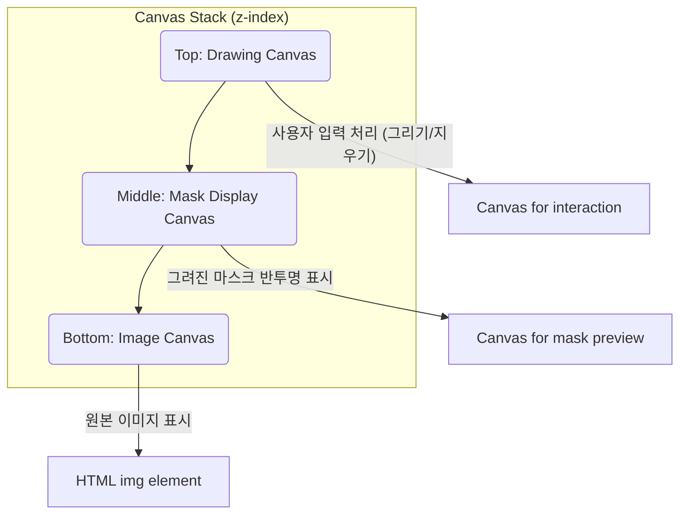

# 기능: 이미지 브러시 - 마스킹 캔버스

## 1. 개요
Image Brush 기능의 핵심 UI로, 사용자가 HTML Canvas 위에서 직접 마스크를 그리거나 지울 수 있는 인터페이스입니다. 이 로직은 `ImageBrushModal.tsx` 컴포넌트 내에 구현되어 있습니다.

## 2. 핵심 파일
- **UI 및 로직**: `src/app/canvas/_components/ImageBrushModal.tsx`
- **타입 정의**: `src/types/image-brush.ts` (e.g., `BrushSettings`, `BrushTool`)

## 3. Canvas 스택 구조
Image Brush 모달은 여러 개의 Canvas 요소를 겹쳐서 구현합니다.



1.  **Image Canvas**: 원본 이미지를 표시하는 기본 Canvas.
2.  **Mask Display Canvas**: 현재까지 그려진 마스크를 반투명한 붉은색 등으로 표시하여 사용자에게 시각적 피드백을 제공.
3.  **Drawing Canvas**: 사용자의 마우스/터치 입력을 직접 받는 최상위 투명 Canvas. 여기서 그려진 내용이 Mask Display Canvas에 반영됩니다.

## 4. 주요 로직 설명

### 1. 초기화
- 모달이 열리면, `useEffect` 훅에서 원본 이미지를 Image Canvas에 그립니다.
- 모든 Canvas의 크기를 원본 이미지의 비율에 맞춰 설정합니다.

### 2. 그리기/지우기 (`draw` 함수)
- `onMouseDown`, `onMouseMove`, `onMouseUp` 이벤트를 사용하여 드래그를 감지합니다.
- `isDrawing` 상태가 `true`일 때, `onMouseMove` 이벤트가 발생할 때마다 `draw` 함수가 호출됩니다.
- **`globalCompositeOperation`**: 이 속성이 핵심입니다.
  - **Brush Tool**: `'source-over'`로 설정하여 새로운 내용을 기존 내용 위에 그립니다.
  - **Eraser Tool**: `'destination-out'`으로 설정하여 기존에 그려진 내용을 지웁니다. (투명하게 만듦)

```typescript
// ImageBrushModal.tsx 내의 그리기 로직 예시
const draw = (e: MouseEvent) => {
  if (!isDrawing) return;

  const canvas = drawingCanvasRef.current;
  const ctx = canvas.getContext('2d');
  const rect = canvas.getBoundingClientRect();

  const x = e.clientX - rect.left;
  const y = e.clientY - rect.top;

  ctx.globalCompositeOperation = currentTool === 'brush' ? 'source-over' : 'destination-out';
  ctx.fillStyle = 'rgba(255, 0, 0, 0.5)'; // 실제 마스크는 단색, UI 표시는 반투명
  ctx.beginPath();
  ctx.arc(x, y, brushSize / 2, 0, Math.PI * 2);
  ctx.fill();
};
```

### 3. 마스크 데이터 추출 (`getMaskAsBase64`)
- "Generate" 버튼을 클릭하면, 현재 Mask Canvas의 내용을 Base64 형식의 PNG 이미지로 변환하여 백엔드(Edge Function)로 전송해야 합니다.
- **중요**: AI API는 보통 흰색 영역을 마스크로 인식하므로, 전송 시에는 반투명한 붉은색이 아닌, 완전한 흰색(#FFFFFF)으로 채워진 마스크 이미지를 생성해야 합니다.

```typescript
const getMaskAsBase64 = (): string => {
  const maskCanvas = maskCanvasRef.current;
  const tempCanvas = document.createElement('canvas');
  tempCanvas.width = maskCanvas.width;
  tempCanvas.height = maskCanvas.height;
  
  const tempCtx = tempCanvas.getContext('2d');
  // 1. 검은색 배경으로 채운다 (마스크되지 않은 영역)
  tempCtx.fillStyle = 'black';
  tempCtx.fillRect(0, 0, tempCanvas.width, tempCanvas.height);
  
  // 2. 마스크가 그려진 부분만 흰색으로 덮어쓴다.
  tempCtx.globalCompositeOperation = 'source-over';
  tempCtx.drawImage(maskCanvas, 0, 0);

  // 3. Base64로 변환
  return tempCanvas.toDataURL('image/png');
};
```

### 4. 실행 취소 (Undo)
- `onMouseUp` 이벤트가 발생할 때마다(즉, 한 번의 그리기/지우기 동작이 끝날 때마다) Drawing Canvas의 상태를 `history` 배열에 저장합니다 (`canvas.toDataURL()` 사용).
- 사용자가 Undo 버튼을 누르면, `history` 배열에서 마지막 상태를 꺼내와 Canvas에 다시 그립니다 (`ctx.drawImage`).
