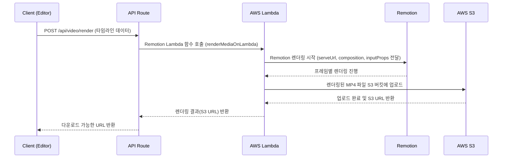

# 기능: 렌더링 및 내보내기 (Rendering & Export)

## 1. 개요
Video Editor에서 편집한 타임라인을 최종 MP4 비디오 파일로 만드는 기능입니다. 이 프로세스는 클라이언트의 요청으로 시작되어 서버 측의 AWS Lambda에서 비동기적으로 처리됩니다.

## 2. 핵심 파일
- **렌더링 요청 API**: `src/app/api/video/render/route.ts`
- **Remotion 컴포지션**: `src/remotion/VideoComposition.tsx` (실제 비디오를 그리는 React 컴포넌트)
- **Remotion 진입점**: `src/remotion/index.ts` (렌더링할 컴포지션들을 등록)
- **AWS Lambda 설정**: `remotion.config.ts`
- **상세 설정 가이드**: `docs/video-render-setup-guide.md`

## 3. 렌더링 워크플로우


## 4. 주요 로직 설명

### 1. 렌더링 요청 (`/api/video/render/route.ts`)
1.  클라이언트로부터 `videoClips`, `textClips`, `soundClips`, `aspectRatio` 등 타임라인의 전체 상태를 `inputProps`로 받습니다.
2.  `@remotion/lambda`의 `renderMediaOnLambda` 함수를 호출합니다.
3.  **주요 파라미터**:
    - `serveUrl`: Remotion 번들이 배포된 S3 URL. Lambda가 이 URL에서 렌더링할 코드를 다운로드합니다. (`REMOTION_SERVE_URL` 환경 변수)
    - `compositionId`: 렌더링할 컴포지션의 ID. `aspectRatio`에 따라 `video-mobile`, `video-square`, `video-wide` 중 하나가 선택됩니다.
    - `inputProps`: 렌더링에 필요한 모든 데이터. `VideoComposition.tsx`의 props로 전달됩니다.
    - `codec`: `h264`로 설정하여 MP4 파일로 출력합니다.
    - `outName`: S3에 저장될 파일명을 지정합니다.

### 2. Remotion 컴포지션 (`VideoComposition.tsx`)
- 이 파일은 React 컴포넌트이지만, 실제로는 Remotion에 의해 각 프레임이 이미지로 렌더링됩니다.
- `useCurrentFrame()` 훅을 사용하여 현재 프레임 번호를 가져옵니다.
- `AbsoluteFill` 컴포넌트를 사용하여 캔버스 전체를 채웁니다.
- `Sequence` 컴포넌트를 사용하여 각 비디오, 텍스트, 사운드 클립을 타임라인의 정확한 위치와 길이에 맞게 렌더링합니다.

```tsx
// VideoComposition.tsx 예시
export const VideoComposition: React.FC<TimelineProps> = ({ videoClips, textClips }) => {
  return (
    <AbsoluteFill className="bg-black">
      {videoClips.map(clip => (
        <Sequence
          key={clip.id}
          from={clip.startTimeInFrames}
          durationInFrames={clip.durationInFrames}
        >
          <Video src={clip.url} />
        </Sequence>
      ))}
      {textClips.map(clip => (
        <Sequence /* ... */ >
          <TextOverlay text={clip.text} style={clip.style} />
        </Sequence>
      ))}
    </AbsoluteFill>
  );
};
```

### 3. 로컬 렌더링 vs Lambda 렌더링
- **로컬 개발 환경**: `process.env.LAMBDA_RENDER_ENDPOINT === 'local'`일 때, `renderMedia` 함수가 직접 호출되어 로컬 머신에서 렌더링이 수행됩니다. 이는 빠른 테스트와 디버깅을 위함입니다.
- **프로덕션 환경**: Vercel에 배포되었을 때는 `renderMediaOnLambda`가 호출되어 AWS Lambda에서 렌더링이 수행됩니다. 이는 서버 부하를 분산시키고 확장성을 확보하기 위함입니다.

## 5. 트러블슈팅

- **렌더링 실패**: CloudWatch에서 Lambda 로그를 확인하는 것이 가장 중요합니다. `remotion-render-{region}` 함수의 로그 그룹을 확인하세요.
- **폰트 깨짐**: Lambda 환경에 폰트 파일이 포함되어 있는지 확인해야 합니다. `src/remotion/load-fonts.ts`와 `remotion.config.ts`의 `bundlerOptions` 설정을 확인하세요.
- **Access Denied**: Lambda의 IAM 역할이 S3 버킷에 대한 `PutObject` 권한을 가지고 있는지 확인하세요.
- **Timeout**: 비디오 길이가 길거나 복잡한 효과가 많은 경우 Lambda의 타임아웃(기본 30초)을 늘려야 합니다. `remotion.config.ts`에서 `timeoutInSeconds`를 300초(5분) 이상으로 설정하는 것을 권장합니다.
