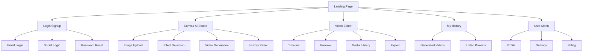
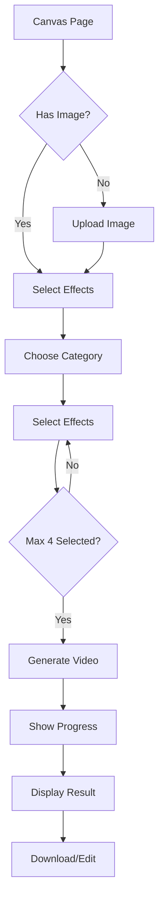
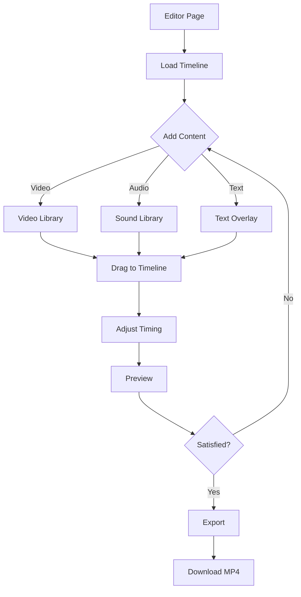

# VogueDrop UI/UX Specification

## Introduction

This document defines the user experience goals, information architecture, user flows, and visual design specifications for VogueDrop's user interface. It serves as the foundation for visual design and frontend development, ensuring a cohesive and user-centered experience.

### Overall UX Goals & Principles

#### Target User Personas
- **Fashion Creator Pro:** Professional fashion content creators who need efficient AI-powered video generation tools for daily content production
- **Emerging Creator:** New fashion influencers learning to create professional content with limited resources
- **Fashion Brand Manager:** Marketing professionals creating promotional content for fashion brands

#### Usability Goals
- **Ease of learning:** New users can generate their first AI video within 3 minutes
- **Efficiency of use:** Experienced users can complete video generation in under 1 minute
- **Error prevention:** Clear visual feedback and confirmation for all destructive actions
- **Memorability:** Intuitive interface allows users to return after breaks without relearning
- **Satisfaction:** Delightful animations and smooth interactions create an enjoyable experience

#### Design Principles
1. **Visual First** - Prioritize visual content and previews over text descriptions
2. **Progressive Disclosure** - Show advanced options only when needed
3. **Immediate Feedback** - Every action has instant visual or auditory response
4. **Consistent Patterns** - Use familiar UI patterns from creative tools
5. **Dark Mode Native** - Designed for extended use in creative environments

### Change Log
| Date | Version | Description | Author |
|------|---------|-------------|---------|
| 2025-01-30 | 1.0 | Initial UI/UX specification | BMad Master |

## Information Architecture (IA)

### Site Map / Screen Inventory

### Navigation Structure

**Primary Navigation:** Horizontal top navigation with logo, main features (Canvas, Editor, History), and user menu

**Secondary Navigation:** Contextual navigation within each feature area (e.g., effect categories in Canvas)

**Breadcrumb Strategy:** Not required due to shallow navigation depth; clear page titles suffice

## User Flows

### AI Video Generation Flow

**User Goal:** Generate an AI fashion video from a static image

**Entry Points:** 
- Landing page CTA
- Canvas menu item
- Quick action from History

**Success Criteria:** User successfully generates and downloads an AI video

#### Flow Diagram

#### Edge Cases & Error Handling:
- Image upload fails: Show error toast with retry option
- Generation timeout: Display timeout message with support contact
- API limit reached: Show upgrade prompt
- Network interruption: Auto-retry with user notification

**Notes:** Generation typically takes 30-60 seconds; show estimated time

### Video Editing Flow

**User Goal:** Edit generated videos with text, music, and transitions

**Entry Points:**
- Video Editor menu
- "Edit" button from Canvas result
- History page action

**Success Criteria:** User exports an edited video with custom elements

#### Flow Diagram

#### Edge Cases & Error Handling:
- Timeline overflow: Prevent adding clips beyond max duration
- Export failure: Show error with retry option
- Unsupported format: Convert automatically or show format guide

**Notes:** Real-time preview essential for user confidence

## Wireframes & Mockups

**Primary Design Files:** Figma (Link to be added)

### Key Screen Layouts

#### Canvas AI Studio
**Purpose:** Main workspace for AI video generation

**Key Elements:**
- Left panel: Effect selection with visual previews
- Center: Large image/video preview area
- Right panel: Generation history log
- Bottom: Quick action bar with generate button

**Interaction Notes:** Drag-and-drop for image upload, click to select effects, hover for previews

**Design File Reference:** Canvas_AI_Studio_Frame

#### Video Editor
**Purpose:** Timeline-based video editing interface

**Key Elements:**
- Top: Preview window with playback controls
- Center: Multi-track timeline
- Bottom: Control bar with sound/text options
- Modals: Media libraries for assets

**Interaction Notes:** Drag clips to timeline, click and drag to trim, spacebar for play/pause

**Design File Reference:** Video_Editor_Frame

#### My History
**Purpose:** View and manage all generated content

**Key Elements:**
- Grid view of video thumbnails
- Filter/sort options
- Batch actions toolbar
- Pagination controls

**Interaction Notes:** Hover for preview, click for details, multi-select with shift-click

**Design File Reference:** History_Page_Frame

## Component Library / Design System

**Design System Approach:** Custom component library built on Tailwind CSS utilities with consistent design tokens

### Core Components

#### Button
**Purpose:** Primary interactive element for actions

**Variants:** Default (primary), Secondary, Outline, Ghost, Destructive, Link

**States:** Default, Hover, Active, Focus, Disabled, Loading

**Usage Guidelines:** Use primary for main actions, outline for secondary, ghost for toolbar items

#### Modal
**Purpose:** Overlay dialogs for focused tasks

**Variants:** Standard, Full-screen, Slide-over

**States:** Open, Closing, Closed

**Usage Guidelines:** Use for media libraries, settings, confirmations

#### Card
**Purpose:** Container for grouped content

**Variants:** Default, Interactive, Media

**States:** Default, Hover, Selected, Loading

**Usage Guidelines:** Use for video thumbnails, effect previews, content groups

#### Input
**Purpose:** Text and file input fields

**Variants:** Text, Textarea, File upload, Search

**States:** Default, Focus, Error, Disabled, Loading

**Usage Guidelines:** Always include labels, show validation inline

## Branding & Style Guide

### Visual Identity
**Brand Guidelines:** Modern, minimal, professional with creative flair

### Color Palette
| Color Type | Hex Code | Usage |
|------------|----------|--------|
| Primary | #38F47C | Main actions, brand identity |
| Secondary | #34C759 | Supporting actions, success states |
| Accent | #1F2937 | Subtle highlights, borders |
| Success | #34C759 | Positive feedback, confirmations |
| Warning | #F59E0B | Cautions, important notices |
| Error | #EF4444 | Errors, destructive actions |
| Neutral | #1F2937, #374151, #6B7280 | Text, borders, backgrounds |

### Typography

#### Font Families
- **Primary:** -apple-system, BlinkMacSystemFont, "Segoe UI", Roboto, sans-serif
- **Secondary:** Same as primary (system fonts)
- **Monospace:** "SF Mono", Consolas, "Liberation Mono", monospace

#### Type Scale
| Element | Size | Weight | Line Height |
|---------|------|--------|-------------|
| H1 | 2.5rem | 700 | 1.2 |
| H2 | 2rem | 600 | 1.3 |
| H3 | 1.5rem | 600 | 1.4 |
| Body | 1rem | 400 | 1.5 |
| Small | 0.875rem | 400 | 1.4 |

### Iconography
**Icon Library:** Heroicons or Lucide React

**Usage Guidelines:** Use outline style for navigation, solid for actions, consistent 24px base size

### Spacing & Layout
**Grid System:** 12-column grid with 24px gutters

**Spacing Scale:** 4px base unit (0.25rem, 0.5rem, 0.75rem, 1rem, 1.5rem, 2rem, 3rem, 4rem)

## Accessibility Requirements

### Compliance Target
**Standard:** WCAG 2.1 AA

### Key Requirements

**Visual:**
- Color contrast ratios: 4.5:1 for normal text, 3:1 for large text
- Focus indicators: Visible 3px ring on all interactive elements
- Text sizing: Minimum 14px, user scalable to 200%

**Interaction:**
- Keyboard navigation: All features accessible via keyboard
- Screen reader support: Proper ARIA labels and roles
- Touch targets: Minimum 44x44px for mobile

**Content:**
- Alternative text: Descriptive alt text for all images
- Heading structure: Logical h1-h6 hierarchy
- Form labels: All inputs have associated labels

### Testing Strategy
- Automated testing with axe-core
- Manual keyboard navigation testing
- Screen reader testing with NVDA/JAWS
- Color contrast validation tools

## Responsiveness Strategy

### Breakpoints
| Breakpoint | Min Width | Max Width | Target Devices |
|------------|-----------|-----------|----------------|
| Mobile | 320px | 639px | Phones |
| Tablet | 640px | 1023px | Tablets, small laptops |
| Desktop | 1024px | 1535px | Laptops, desktops |
| Wide | 1536px | - | Large monitors |

### Adaptation Patterns

**Layout Changes:** 
- Mobile: Stack panels vertically, hide secondary elements
- Tablet: 2-column layouts, collapsible sidebars
- Desktop: Full 3-panel layouts

**Navigation Changes:** 
- Mobile: Hamburger menu
- Tablet+: Full horizontal navigation

**Content Priority:** 
- Mobile: Show only essential controls
- Desktop: Show all options and previews

**Interaction Changes:** 
- Mobile: Touch gestures, larger tap targets
- Desktop: Hover states, keyboard shortcuts

## Animation & Micro-interactions

### Motion Principles
- **Purpose-driven:** Every animation has a clear function
- **Fast & subtle:** 150-300ms duration for most transitions
- **Consistent easing:** Use ease-out for entrances, ease-in for exits
- **Respect preferences:** Honor prefers-reduced-motion

### Key Animations
- **Page Transitions:** Fade with subtle slide-up (Duration: 300ms, Easing: ease-out)
- **Modal Open/Close:** Scale and fade (Duration: 200ms, Easing: ease-out)
- **Button Hover:** Scale 1.05 with shadow (Duration: 150ms, Easing: ease-out)
- **Loading States:** Pulse or shimmer effect (Duration: 1.5s, Easing: ease-in-out)
- **Success Feedback:** Check mark draw-in (Duration: 400ms, Easing: ease-out)
- **Image Upload:** Fade in with scale (Duration: 300ms, Easing: ease-out)

## Performance Considerations

### Performance Goals
- **Page Load:** < 3 seconds on 3G
- **Interaction Response:** < 100ms for UI feedback
- **Animation FPS:** Consistent 60fps

### Design Strategies
- Lazy load images below the fold
- Use skeleton screens during loading
- Optimize images to WebP format
- Implement virtual scrolling for long lists
- Progressive enhancement for complex features

## Next Steps

### Immediate Actions
1. Create high-fidelity mockups in Figma
2. Develop interactive prototypes for key flows
3. Conduct usability testing with target users
4. Create detailed component specifications
5. Build accessibility testing plan

### Design Handoff Checklist
- [x] All user flows documented
- [x] Component inventory complete
- [x] Accessibility requirements defined
- [x] Responsive strategy clear
- [x] Brand guidelines incorporated
- [x] Performance goals established

## Checklist Results

This UI/UX specification provides comprehensive guidelines for VogueDrop's interface design. The dark-mode-first approach with vibrant green accents creates a modern, professional aesthetic suitable for creative professionals. The component-based architecture ensures consistency while the performance and accessibility requirements guarantee a quality experience for all users.